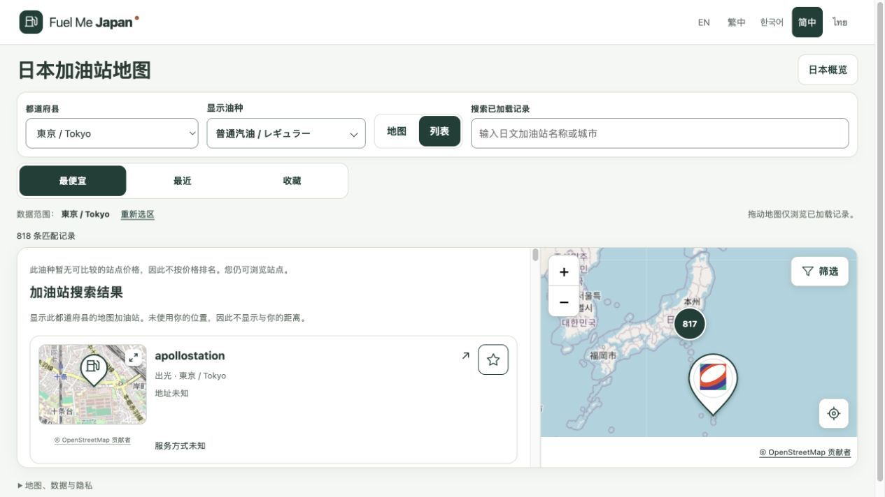

# M0.1 地图增强发布报告

日期：2026-09-30。结果：**PUBLISHED_VERIFIED**。

用户已验收并明确授权推送和上线。本次发布包含列表的最便宜／最近／收藏、列表总地图与逐站小地图、悬停联动、多油种选择，以及油种选项文字点击导致浏览器崩溃的修复。

- GitHub：<https://github.com/zhyphil/fuel-me-japan>；`main` 与 `codex/m0-1-find-fuel` 已推送应用提交 `47ba051e54b84784af7e354ad0e2cadc2864d32a`。
- 正式网站：<https://fuel-me-japan.com/zh-Hans/>。
- 固定部署：<https://76736e97.fuel-me-japan.pages.dev>；部署 ID `76736e97-5309-443f-9cef-e6a868ab1531`，环境 Production，分支 main，源提交 `47ba051`。
- 先前部署 `add49cc0-3d89-4a8e-84c9-3632fca1e57e` 保留，可用于回退；本次没有执行回退。

## 验收结果

| 项目 | 结果 | 依据 |
| --- | --- | --- |
| lint、typecheck、静态构建 | PASS | 复用最终修复的完整检查；发布前 70 个源码／测试文件和 84 个保护文件快照全部匹配 |
| 单元测试 | PASS | 180 项；详见 `M0.1-fuel-label-fix.md` |
| 浏览器测试 | PASS | 152 项；含鼠标文字点击、触屏点击、键盘交互回归 |
| GitHub 发布 | PASS | `git ls-remote` 已确认两条远端分支指向上述应用提交 |
| Cloudflare 部署 | PASS | Wrangler 退出码 0；生产部署元数据关联同一应用提交 |
| HTTP 与静态产物 | PASS | 18 项请求均 HTTP 200，响应逐字节匹配本地构建；覆盖五语言、资源、数据登记、主域／www／Pages 域／固定部署域 |
| 真实生产浏览器 | PASS | 油种文字选择正常并恢复原选择；东京 818 条记录、三个排序入口、两级地图可见；列表记录可打开对应详情；没有控制台错误 |

本轮没有重新执行完整测试链，而是验证最终已通过检查的代码与产物一致。首次域名检查的一个普通脚本请求返回 HTTP 403；使用标准浏览器 User-Agent 的一次有界复核后，全部请求通过。原始过程没有被记作首次即成功。

构建产物中复制的 0 字节 `data/.import.lock` 已在上传前排除，原始 public 数据不变。后续构建仍应检查此临时文件。

## 边界与后续

站点即时油价仍未接入，gogo.gs 咨询待答复，未知价格不会伪造成报价。保持现有 noindex。没有申请真实设备定位，没有把本轮桌面浏览器检查当作 Safari、真实手机或母语安全文案验收。既有数据自动下载 HTTP 403 和定时任务实际运行的限制未在本次变更。

本次发布仅涵盖已验收 M0.1。下一步按用户最新授权实施 M0.2「我的车辆用油」，保留地图首页；新车型来源、使用权与安全文案完成核验之前不提升为生产 VERIFIED 结果。

证据：`reports/evidence/m01/enhancements-release-20260930/`。本报告的后续文档提交不改变应用部署源提交。

