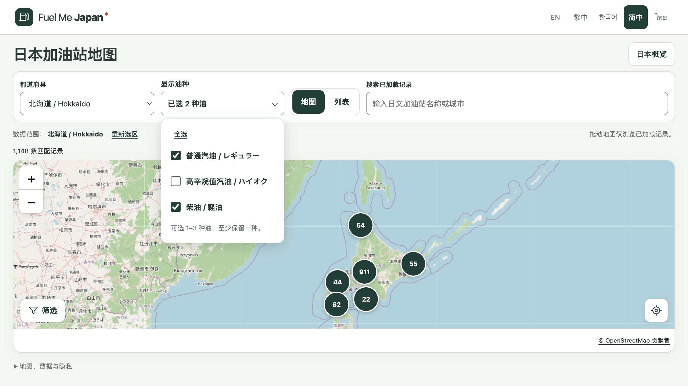

# M0.1 油种文字点击崩溃修复报告

日期：2026-09-30。状态：PASS（本地修复与验收，未提交、推送或部署）。

## 问题与原因

用户报告点击复选框右侧油种文字后出现浏览器崩溃页。已在本地 Codex 浏览器复现；新增自动化回归在修复前同样得到鼠标 `mouse.down: Target crashed` 和触屏 `touchscreen.tap: Target crashed`，键盘用例通过。

事件轨迹显示：按下标签文字后，浏览器在标签默认勾选执行前，将焦点从 summary 暂时移到外层 `MAIN#main`。面板的失焦逻辑同步关闭原生 details，触发 Chromium 渲染进程崩溃。临时阻止失焦处理后，同样操作可完整经过标签 click、checkbox focusin、click、change；替换 fieldset 仍会崩溃，单纯忽略空 relatedTarget 也不足以修复。

补查确认面板说明文字和空白处存在相同问题。最终在字段组的 pointerdown 捕获阶段，仅阻止非可用控件区域的默认临时聚焦；保留可用 checkbox／全选按钮的原生聚焦、标签原生点击勾选，以及 Tab、Escape、外部点击关闭行为。没有添加延时关闭或改变燃油选择规则。

## 验证

| 检查 | 最终结果 |
|---|---|
| 原缺陷复现 | 修复前鼠标、触屏均崩溃 |
| 针对性回归 | 3 项通过；覆盖文字长按、触屏、说明和空白、禁用控件、逐次切换及最后一项保护 |
| lint / typecheck | PASS |
| 单元测试 | 180 通过 |
| 构建与五语言预渲染 | PASS |
| 全部浏览器测试 | 152 通过，0 失败／跳过／不稳定测试 |
| 完整 npm run check | 退出码 0 |
| 冻结保护文件 | 84 项哈希一致 |
| 历史截图 | 41 项恢复后哈希一致；新回归截图独立保存 |

最终在本地 Codex 浏览器重新加载页面，加载北海道站点后点击说明文字、勾选和取消高辛烷值汽油文字，面板保持打开，选中数量正确，未再崩溃且控制台无错误。验证后恢复原来的普通汽油与柴油偏好。

此前测试通过但遗漏了文字路径：既有 helper 使用 input.check/uncheck，不能证明点击旁边标签文字正常。现已补足这类真实指针操作测试。触屏通过 Chromium 模拟验证，不代表真实手机或 Safari 验收。

## 范围与证据

应用代码仅修改 FuelSelection 的面板指针处理；新增浏览器回归。生产站点报价仍为空，数据和权限不变。本地预览为 http://127.0.0.1:4174/zh-Hans/。

- [原始失败回归](evidence/m01/fuel-label-fix/regression-before.txt)
- [焦点事件诊断](evidence/m01/fuel-label-fix/focus-diagnosis.txt)
- [相邻区域复现](evidence/m01/fuel-label-fix/adjacent-before.txt)
- [最终针对性回归](evidence/m01/fuel-label-fix/regression-after.txt)
- [最终完整检查](evidence/m01/fuel-label-fix/full-check.txt)
- [浏览器结果](evidence/m01/fuel-label-fix/browser-results.json)
- [文件与历史截图保护核验](evidence/m01/fuel-label-fix/verification.json)
- [最终源码与测试哈希](evidence/m01/fuel-label-fix/source-final-sha256.json)

