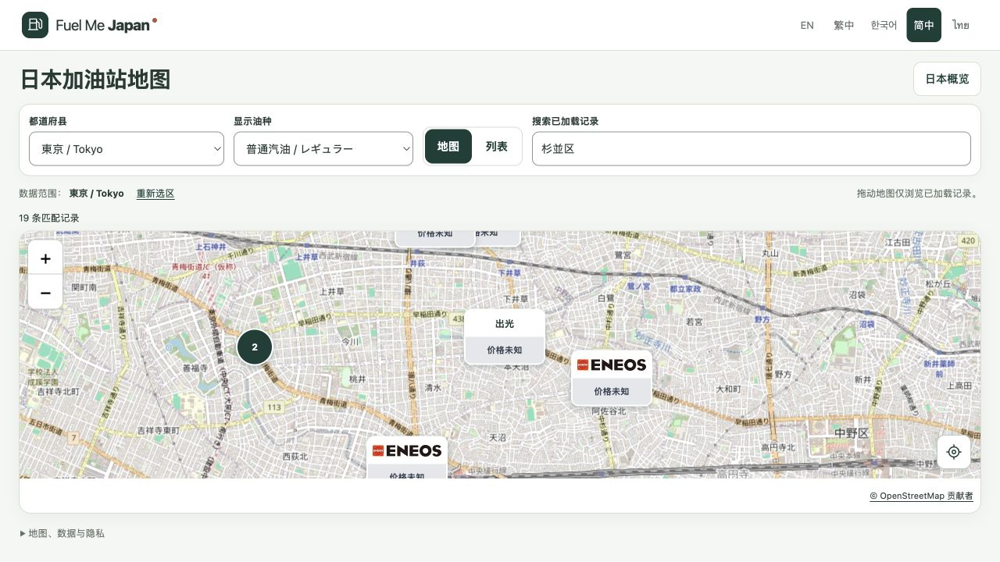

# 油种偏好与站点价格标记完成报告

日期：2026-09-30。工作区：`/Users/haoyuzuo/.codex/worktrees/fuel-find/Fuel Me Japan`；分支：`codex/m0-1-find-fuel`。

**界面与本地验证：PASS。真实单站价格接入及真实高低价比较：BLOCKED。** 本轮只完成用户直接提出的品牌标记、油种偏好与价格显示规则，尚无真实单站报价来源；未发布、未提交或推送，未进入 M0.2。

## 已完成的行为

- 地图上的独立站点改为上方品牌标识、下方价格条，打开详情前即可看到。密集站点保留数量聚合，放大后显示各站点。
- 默认显示普通汽油 / レギュラー。可选择柴油 / 軽油或高辛烷值汽油 / ハイオク，地图、列表、聚合成员列表和详情同步使用这一油种。
- 只有用户主动选择后才在本机保存油种枚举。刷新、切换界面语言后恢复；阻止存储或无效值时仍可使用。恢复默认只清除本功能的偏好，不清除其他存储。不保存车辆资料或位置，也不自动判断车辆应使用的燃油。
- 有明确品牌映射的 ENEOS、Cosmo 使用本地图标。其他品牌显示原始品牌文字，没有品牌信息时保留通用加油符号；图片失败时回退到品牌文字。没有将旧 Shell 或出光记录推断成其他新品牌。
- 保留五种界面语言、日文安全标签、地图右下角定位图标、键盘打开和返回、营业时间翻译及原有详情功能。

## 价格的真实边界

逐项读取现有数据后确认：**16,454 条站点记录没有单站售价字段**。现有 **141 条价格记录均为都道府县官方参考价**，不代表任何单站售价，继续单独放在详情中。

本次生产报价集合 `STATION_QUOTES` 为空。实际站点价格条显示灰色“价格未知”；只有数据明确标记某油种为 `NO` 时显示“不供应”。不能从未知油种、品牌或地区参考价推断售价、库存或供应情况。合成数字只存在于测试，不进入构建产物，不提供隐藏演示入口。

已询问用户是否有可用单站报价接口或数据说明，本报告生成时尚未收到来源。接入真实报价仍需明确来源使用条件、站点对应关系、油种、含税现金普通客户口径、观察及抓取时间、有效期限；接入后还须验证实际来源及页面更新时的时效处理。目前不把真实比价功能标为完成。

## 颜色规则

有效单站报价须具有明确来源、HTTPS 来源链接、JPY/L 单位、普通客户含税现金口径，以及有效观察、抓取和到期时间。拒绝缺失、非数值、非正价格、过期、未来时间、时间倒置、冲突重复记录及其他计价条件。

相同油种下，只比较已加载结果中同一都道府县、来源、价格口径、单位和日本观察日的报价。至少需要 3 个站点且存在 3 个不同价位，才将不同价位排序分成三档：**低价绿色、中价橙色、高价红色**，同价同色。文字标签同时解释价位，避免仅靠颜色识别。数量不足或全部同价时仍显示有效金额，但保持灰色并注明不可比较。

搜索、分页和拖动不会改变比较基准。此规则已经通过合成报价的单元测试，**不构成真实报价来源或市场价格准确性验证**。

## 品牌资源来源

两个 SVG 均保留原文件，来源、哈希、用途及复核日期登记于 `public/brands/sources.json`：

- [ENEOS 文件来源页](https://commons.wikimedia.org/wiki/File:ENEOS_logo.svg)。
- [Cosmo Oil 文件来源页](https://commons.wikimedia.org/wiki/File:Cosmo_Oil_company_logo.svg)。

来源页声明为 `PD-textlogo`；品牌商标仍归原权利人，本次仅识别数据中记录的品牌，不表示合作或背书，也不等于确认整个品牌素材库的商业使用许可。已检查两个 SVG，无脚本、外链或事件处理属性；不在运行时请求第三方图标服务。

只读查看的 [gogo.gs 旧 API 公告](https://api.gogo.gs/) 说明旧 API 支持已结束，本次没有将其当成可用报价源，也没有抓取或转载其价格。

## 验证结果与证据

最终使用 Node 24.18.0 执行 `npm run check`，**退出码 0**。

| 检查 | 实际结果 |
| --- | --- |
| lint | PASS，零警告 |
| typecheck | PASS |
| 单元测试 | PASS，10 个文件、107 项 |
| 静态构建与五语言预渲染 | PASS |
| Chromium 浏览器测试 | PASS，53 项，零跳过、零失败 |
| 新增浏览器行为 | 5 项，覆盖偏好恢复、未知价格一致性、切换不改变地图或请求定位、两个品牌完整显示及加载失败回退、异常存储 |
| 品牌图片裁切回归 | 修复前两项失败，修复后通过 |
| 原规格、原数据、导入代码 | 84 个文件哈希未变 |
| 实际浏览器预览 | 本地中文地图可显示真实底图、完整品牌图标和灰色未知价格条 |

[完整检查日志](evidence/m01/fuel-price-markers/check.txt)、[浏览器结果](evidence/m01/fuel-price-markers/browser-results.json)、[数据核验](evidence/m01/fuel-price-markers/data-audit.json)、[审查问题处置](evidence/m01/fuel-price-markers/review-resolution.md)。原始工具日志保持原文；JSON 报告的解释字段使用简体中文。

浏览器自动化继续拦截外部网络，使用离线底图。标有 `offline-tiles` 的截图仅证明布局与交互。上图来自本地最终构建的实际底图预览，仅证明当时可用。未调用用户真实定位，未做真机 Safari 或人工母语审核。

## 变更范围与停止点

新增 `FuelPrice`、油种偏好、报价显示规则、品牌映射、两个品牌资源及对应测试；修改地图、查找入口、样式和五语文案。独立审查发现的测试 JSON 加载问题和主代理发现的品牌裁切问题均已修复并回归。

截图只作为标记设计参考，没有据此增加车辆管理、支付或服务筛选、账户、价格提醒、路线规划、报价爬虫、后端或数据库。原始 00–10 规格保持不变，既有未提交改动保留。AO 共执行方案、实现、独立只读审查三个有边界的阶段，每阶段 1 个步骤；没有因此扩大产品范围。

本轮停止在本地可审核状态。真实单站油价接入仍待来源；线上站点没有本轮变更，部署状态为 `NOT_DEPLOYED`。

## 后续用户审核调整：无价格时隐藏价格区域（2026-09-30）

按用户本次要求，**只有有效单站报价才显示价格**。地图不再显示“价格未知”或灰色占位条，无报价标记缩为 44 px 高度，仅保留品牌图标／名称；无障碍名称和悬停提示也不再包含未知价格。列表与聚合成员列表同步隐藏价格元素，详情隐藏整个空价格区域。详情中的原始燃油供应情况保持可见，未知不转成不供应。

已有价格但不足以比较高低的报价仍显示金额，不因灰色状态被隐藏；现有地区参考价区未修改。报价数据仍为空，此次显示调整不表示完成真实单站价格接入。

完整 `npm run check` 退出码 0：lint、typecheck、108 项单元测试、构建及五语言预渲染、53 项浏览器测试全部通过。新增断言核对五种语言下无价不产生文本或空元素，并保留有效金额；现有浏览器测试验证品牌完整显示、标记高度、列表与详情无空框。主代理核对实际差异及本地真实预览，原规格／数据／导入代码 84 个文件哈希不变。未提交、推送或部署。

证据：[完整检查](evidence/m01/hide-unknown-price/check.txt)、[浏览器结果](evidence/m01/hide-unknown-price/browser-results.json)、[更新后的真实预览](evidence/m01/hide-unknown-price/map-live-zh-Hans.png)。此前报告中“灰色价格未知”描述和旧截图仅记录上一次实现，以本节为当前显示行为。

## 后续用户审核调整：水滴形站点标记（2026-09-30）

按用户要求，将独立站点改为 Gas Now 参考样式的水滴标记：白色圆头、细边框、底部尖端，上半部居中显示品牌图标或名称。有有效报价时在下半部叠加价格条，无报价仍不显示价格文字或占位。轮廓用本地内联 SVG 绘制，无新增依赖或外部资源。

地图锚点改到尖端底部，站点坐标保持不变；增加显示范围顶部留白，并调整手机详情地图高度及选中站点的视图偏移，保证标记完整可见。保留键盘焦点、选中态、聚合数量和品牌加载失败回退。以前的矩形及 44 px 高度描述为历史记录，当前站点按钮为 96 × 94 px。

只读专项复核指出底端锚点可能导致手机详情裁切，已在实现中处理，保留原有 320/390/1280 px 完整可见断言。实际预览发现 Leaflet 的 SVG 层级会遮住品牌；补充断言后两个品牌用例均先失败，随后用局部样式修复并回归通过。主代理已核对最终差异和真实预览，品牌图标及文字完整可见。

最终 `npm run check` 退出码 0：lint、typecheck、108 项单元测试、静态构建和五语预渲染、53 项浏览器测试全部通过。原规格／数据／导入代码 84 个文件哈希不变。未提交、推送或部署，真实单站报价接入状态仍为 BLOCKED。

证据：[完整检查](evidence/m01/droplet-markers/check.txt)、[层级修复前失败](evidence/m01/droplet-markers/stacking-before-fix.txt)、[实际地图预览](evidence/m01/droplet-markers/map-live-zh-Hans.png)、[手机详情布局（离线底图）](evidence/m01/droplet-markers/map-detail-320-offline-tiles.png)。

## 后续用户审核调整：水滴内只显示图标（2026-09-30）

按用户要求，水滴上半部仅显示独立品牌图标，移除图标外侧的长品牌文字。ENEOS 使用原资源中的红橙方形标志，Cosmo 使用独立彩色标志；图标自身的内部字样保留。没有已确认品牌图标的站点以及图片加载失败的情况，统一显示默认加油站图标，不回退品牌名称文字。详情页、列表和无障碍名称仍保留完整品牌信息。

新增 `eneos-symbol.svg`、`cosmo-symbol.svg` 派生图标及产品通用 `fuel-pump.svg`。原品牌文件及哈希保持不变，派生文件的提取路径、视框、哈希和变换版本登记于 `public/brands/sources.json`。独立只读复核核对了图标路径及边缘范围，主代理采用有余量的视框保留完整细部，检查无脚本及外链，实际预览确认图标清晰显示。

完整 `npm run check` 退出码 0：lint、typecheck、108 项单元测试、构建与五语言预渲染、53 项浏览器测试全部通过。已有用例同步验证独立图标加载、无品牌图标与图片加载失败时的默认加油站图标、无额外品牌文字、尺寸与图层顺序。原规格／数据／导入代码 84 个文件未变，无价格不显示价格条的行为保留，未提交、推送或部署。

证据：[完整检查](evidence/m01/brand-symbols/check.txt)、[浏览器结果](evidence/m01/brand-symbols/browser-results.json)、[实际预览](evidence/m01/brand-symbols/map-live-zh-Hans.png)。此前报告中“无图标时显示品牌名称”的描述仅记录旧版本，当前以本节为准。
