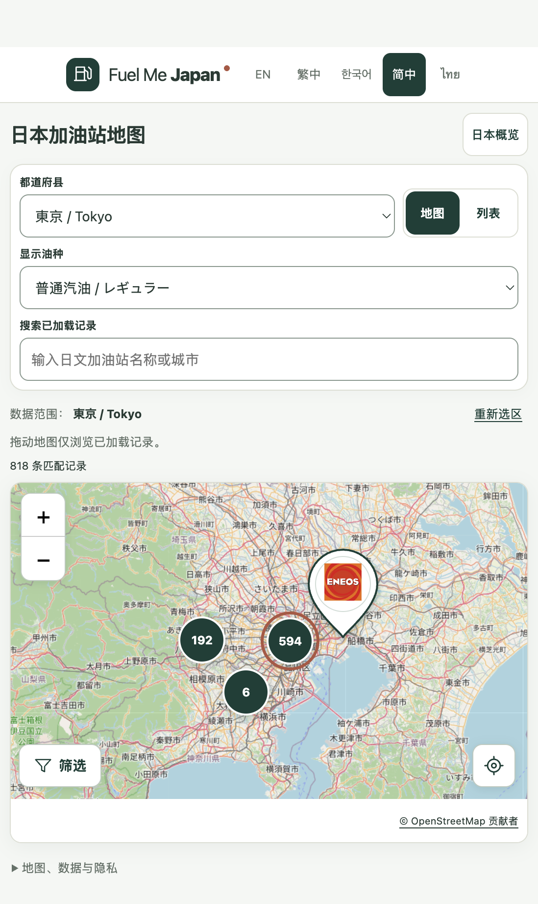

# 地图平滑缩放完成报告

日期：2026-09-30。结论：本地实现与检查通过，等待用户体验验收。

工作区：`/Users/haoyuzuo/.codex/worktrees/fuel-find/Fuel Me Japan`，分支 `codex/m0-1-find-fuel`。
预览：[简体中文地图](http://127.0.0.1:4174/zh-Hans/)。本次未提交、推送或部署。

## 问题与修复

原实现会在缩放动画期间丢弃后续滚轮输入；缩放结束和移动结束又分别触发全量重建标记。聚合点点击原先关闭动画，因此直接跳到下一级。

- 新增输入队列，保留连续滚轮和按钮操作，支持反向与上下限，并让新的地区、概览或站点跳转优先。
- 把缩放结束、移动结束和尺寸变化合并到同一绘制帧；动画期间暂缓结构更新，结束后处理最终状态。
- 缓存当前数据与缩放级别的聚合结果；平移时只筛选可见区域。地区汇总锚点随数据目录变化更新。
- 按完整成员身份复用标记、按钮、品牌图标及事件，只更新变化的部分；保留键盘焦点。
- 聚合点加入放大过渡；队列控制的缩放即时遵循系统“减少动画”偏好，保留原生双指触摸缩放。

## 同条件验证

固定东京818条真实记录、1280×900视口与离线瓦片，排除第三方瓦片网络波动。

| 场景 | 修复前 | 修复后 |
| --- | --- | --- |
| 单次滚轮缩放幅度 | 约0.25级 | 约0.25级 |
| 第一次动画中再滚动同样一次 | 仍约0.25级，第二次丢失 | 约0.50级，两次均生效 |
| 小幅平移后3个相同标记 | 全部删除重建，保留0个 | 新建0个、删除0个，保留3个 |

新增的对应回归用例在原版本失败，在最终版本通过。精确值见 [comparison.json](evidence/m01/map-zoom/comparison.json)。

## 最终检查

`npm run check` 退出码为0。

| 检查 | 结果 |
| --- | --- |
| lint | PASS |
| typecheck | PASS |
| 单元测试 | 138 / 138 PASS |
| 静态构建与五语言预渲染 | PASS |
| 浏览器测试 | 82 / 82 PASS |

其中9项缩放用例覆盖连续滚轮、反向输入、按钮连点、平移标记复用、全国概览切换、动态减少动画、双指触摸、上下限快速反向和旧聚合点竞争。既有筛选、品牌图标、未知价格隐藏、详情及焦点恢复、同坐标聚合、五语言与窄屏测试仍通过。

完整检查首次发现隐藏地图的空结果残留，已修复。旧聚合点测试补充等待动画完成，原有业务断言保留。

独立只读审查发现2项P2，无P1：旧聚合点可能覆盖新概览跳转，以及极限缩放处立即反向可能丢失输入。两项均由新增回归复现，再修复通过。原始审查和处理过程见 [review-resolution.md](evidence/m01/map-zoom/review-resolution.md)。最终修复由根代理核对，未再次独立复审。

## 范围与证据边界

本次修改5个既有源码/测试文件，新增4个地图工具/测试文件；此前工作区改动完整保留。84个数据、导入与规格文件校验一致。未改变品牌资产、五语言文案、瓦片供应商、`keepBuffer: 0`、`updateWhenIdle: true`、价格来源、定位与隐私规则，未扩大到新里程碑。

内置浏览器已检查最终构建的聚合点操作，无控制台错误或横向溢出。浏览器截图见下。CDP原始追踪一并保留作为诊断：前后聚合点击从无动画改为有动画，因此不直接比较CPU耗时降幅。

自动化证明输入保留和减少标记重建；不等同于真实Mac触控板人手验收，不作固定60FPS承诺。网络瓦片加载速度和既有数据覆盖限制仍然存在。

证据目录：`reports/evidence/m01/map-zoom/`，包括修改前失败日志、首次检查、审查回归失败日志、最终检查日志、前后行为数据、源文件哈希、范围校验、审查处理记录和浏览器截图。
