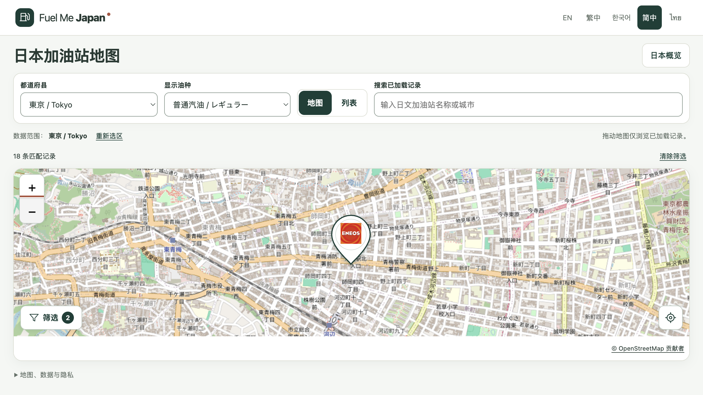

# M0.1 地图版发布报告

日期：2026-09-30。结论：**已推送GitHub并完成生产发布，正式域名验证通过（PASS）。**

正式网站：[Fuel Me Japan 简体中文](https://fuel-me-japan.com/zh-Hans/)。

## 发布版本

- GitHub：`zhyphil/fuel-me-japan`，`main`及`codex/m0-1-find-fuel`已推送。
- 本次应用源码提交：`5ee4b56a90527e99edc6f664859228e1dd77ee74`。
- Cloudflare Pages：`fuel-me-japan`，生产分支`main`，部署`add49cc0-3d89-4a8e-84c9-3632fca1e57e`。
- 固定部署地址：https://add49cc0.fuel-me-japan.pages.dev。
- 发布内容：地图首页、品牌水滴、油种偏好、未知价格隐藏、品牌／支付／服务筛选、营业时间本地化及平滑缩放。

发布记录和截图在实际验收完成后以独立文档提交补齐；该文档提交不改变此次部署的应用源码或静态产物。原有各次本地报告保留生成时的“未发布”等历史说明。

## 实际验证

项目既有`npm run deploy`流程完整执行，退出码0：lint、typecheck、138项单元测试、静态构建／五语言预渲染，以及82项浏览器测试均通过，然后上传并部署。Cloudflare返回的生产部署明确绑定上述源码提交。

正式域名共21项HTTP检查全部通过，覆盖根页面、五种语言、应用与地图脚本、样式、地图配置、品牌图标、数据目录、东京分区和构建来源记录，以及www、pages.dev与固定部署地址。返回内容与本次本地构建逐字节一致；响应仍包含既有安全策略。

实际浏览器访问`fuel-me-japan.com`并确认：

- 全国概览16,454条数据记录，东京818条。
- ENEOS筛选391条，叠加自助加油后18条，地图同步显示。
- 站点详情可打开和关闭；ENEOS オブリステーション的已记录营业时间显示为“每天24小时营业”。
- 东京官方地区参考价正常加载：普通171.0、高辛烷179.7、柴油159.0日元／升；调查2026-09-28，发布2026-09-30。页面明确说明其不是单站售价。
- 缩小控件将地图从16级调整到15级，底图成功加载；无地图错误提示、控制台错误或横向溢出。未触发设备定位。

## 边界与回退信息

原有站点快照、规格、定位规则和`noindex`均保留。未知单站价格继续隐藏。自动抓取官方价格的既有403限制、真实设备／Safari和人工母语安全文案审查仍不因本次发布自动通过。GitHub候选数据工作流已随代码进入默认分支，其定时执行尚未验证，不能直接推送或部署候选数据。

前一生产部署：`f663477a-1601-4189-ad81-c6c8dfec2ca5`，https://f663477a.fuel-me-japan.pages.dev；保留供需要时人工回退，本轮未执行回退。主项目目录原有未提交修改保持不动；发布来自现有地图工作区。

## 证据

- [完整检查和部署日志](evidence/m01/release-20260930/deploy-and-check.txt)
- [HTTP与文件比对](evidence/m01/release-20260930/http-verification.json)
- [浏览器验收](evidence/m01/release-20260930/browser-verification.json)
- [部署记录](evidence/m01/release-20260930/deployment.json)
- [发布产物哈希](evidence/m01/release-20260930/deployed-assets-sha256.json)

发布方法依据[Cloudflare Pages Direct Upload](https://developers.cloudflare.com/pages/get-started/direct-upload/)及本机固定Wrangler 4.144.0帮助。底图配置按[OSM瓦片政策](https://operations.osmfoundation.org/policies/tiles/)复核：可见署名、正常浏览器缓存及Referer、仅请求当前视窗；自动化测试使用离线合成瓦片，没有批量抓取底图。
