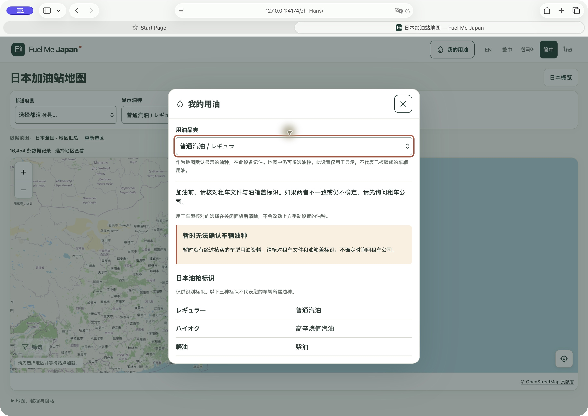

# M0.2 验收补充：Safari、五语言与车型来源

日期：2026-09-30。状态：`LOCAL_FIX_VERIFIED_DATA_BLOCKED`。

本轮发现并修复了 Mac Safari 中“我的用油”原生下拉框显示高度偏小的问题；完整检查通过。已进一步核对五语言文案，并把车型来源核查推进到具体手册章节及生产期。**真实车型映射仍为空，完整 M0.2 验收尚未完成。**

基线：`6e0b98948e6bc22177db2fb624e79cf77419669a`；工作区：`codex/m0-2-my-fuel`。范围为 NORMAL 的有边界验收与必要修复，未调用付费 AO 或并行代理。此次未提交、推送或部署；线上仍是上轮已发布版本，见 [发布报告](M0.2-release.md)。

## 修复与本机验证

Safari 26.6.2 原生菜单的外观没有随 `min-height: 44px` 正常放大，而同页指定固定高度的地区下拉框正常。因此给“我的用油”现有下拉框补充 `height: 44px`，保留原生菜单与原有最小高度。实际 Safari 刷新后，控件恢复标准高度，仍可选择三种油种。

已在本机 Safari 中文界面操作：打开面板、选择柴油、关闭后核对地图、刷新后重新打开确认柴油仍保存、Escape 关闭及入口焦点恢复；修复后又选择高辛烷值汽油并恢复普通汽油。未申请定位。

既有五语言手动油种浏览器用例增加实际控件宽高至少 44px 的断言。Safari 缺陷由原生浏览器截图复现并做修改前后对照；本轮自动测试使用 Chromium，**没有将该断言的通过说成 WebKit 自动化红绿验证**。项目要求的 WebKit 测试版本未安装，本轮没有额外安装浏览器或修改系统设置。

| 检查 | 结果 | 范围 |
| --- | --- | --- |
| lint / typecheck / build | PASS | 本轮 `npm run check` 退出码 0 |
| 单元测试 | PASS | 247 项 |
| 浏览器测试 | PASS | 179 项；0 失败、0 跳过、0 flaky；Chromium |
| 五语言小屏与桌面 | PASS | 320px / 1280px；真实空数据、日文标签、无横向溢出、焦点与偏好流程 |
| 本机 Safari | PASS | macOS Safari 26.6.2，中文界面实际操作；截图留存 |
| 真实 iPhone / Android 手机 | NOT_TESTED | 视口模拟与 Mac Safari 均不能代替真实手机 |
| 历史资料保护 | PASS | 84 个保护文件未变；核对 161 张历史截图，测试重写的 11 张已恢复 |

完整日志、浏览器结果、最终源码指纹及截图位于 [本轮证据目录](evidence/m02/acceptance-20260930/)。

## 五语言文案核对

本轮做的是 **机器辅助语义核对**。五语言全部 `myFuel*` 文案、日文标签及对应哈希已保存至 [待人工审核快照](evidence/m02/acceptance-20260930/safety-copy-precheck.json)。与生产候选登记中的五个哈希一致，没有改动文案或审核状态。

| 界面语言 | 普通汽油 | 高辛烷值汽油 | 柴油 |
| --- | --- | --- | --- |
| en | Regular petrol | High-octane petrol | Diesel |
| zh-Hant | 普通汽油 | 高辛烷值汽油 | 柴油 |
| ko | 일반 휘발유 | 고급 휘발유 | 경유 |
| zh-Hans | 普通汽油 | 高辛烷值汽油 | 柴油 |
| th | เบนซินธรรมดา | เบนซินออกเทนสูง | ดีเซล |

五语言均保留 `レギュラー / ハイオク / 軽油`；地图与面板油种译名一致。逐项核对了“不确定时询问租车公司”“资料冲突时停止核对”“不选相似车辆”“手动偏好不代表车辆已核验”以及关闭面板清除车型选择的含义。未发现需要立即更改的语义冲突；这不代表母语者已审查措辞、语气与现场可理解性。

[丰田租车英文加油说明](https://rent.toyota.co.jp/global_eng/drive/refueling.html)可支持三种油种的基本分类及应使用适合车辆的燃油这一原则；[JAF 的误加油说明](https://jaf.or.jp/common/car-trouble-qa/gasoline/refueling/faq78)说明了汽油与柴油混用的风险。本轮未复制其图片、完整操作指南，也未扩展 M0.3 内容。

`safetyReview.status` 仍为 `PENDING_REVIEW`，reviewer 与 reviewedAt 仍为空。人工审核应针对快照中的实际文字版本，不能只审核中文说明后代替其他语言签署。

## 车型来源的新进展

[丰田手册目录](https://manual.toyota.jp/yaris/)按生产年月及动力类别区分版本。本轮定位了下列具体条目；它们仅是审查候选及对照，未加入 `public/data/vehicles/`。

| 候选或对照 | 目录标明的生产期 | 本次读到的手册燃油内容 | 具体章节 |
| --- | --- | --- | --- |
| YARIS 汽油版 | 2025-02 至 2026-01 | 无铅普通汽油 | [对应手册](https://manual.toyota.jp/yaris/2503/cv/ja_JP/contents/vhch04se040401.php) |
| YARIS 混合动力版 | 2025-02 至 2026-01 | 无铅普通汽油 | [对应手册](https://manual.toyota.jp/yaris/2503/hev/ja_JP/contents/vhch04se040401.php) |
| GR YARIS 汽油版（区分相似名称的对照） | 2025-09 至 2026-02 | 无铅高级汽油 | [对应手册](https://manual.toyota.jp/gr_yaris/2510/cv/ja_JP/contents/vhch04se040401.php) |

定位路径均为“給油口の開け方 → 給油する前に → 燃料の種類について”。该表仅概述读到的证据，不是给具体车辆的用油建议。目录界定生产期，正文界定燃油，两者需要一起核对；目录名称或 URL 编号均不能单独视为精确车辆身份。

由此确认了一个接入前必须解决的问题：当前实现的 `modelYearFrom/modelYearTo` 表示车型年款，无法直接表达上述生产年月范围，也不能由初次登记年份推断。因此不能把上述网页直接转换成 VERIFIED 行；首先需要可靠的精确配置／车辆身份及生产期对应方式。

已复核 [Toyota 网站使用说明](https://toyota.jp/attribute/)与[丰田租车网站使用说明](https://rent.toyota.co.jp/static/footer/policy/website.html)。公开可读并不自动完成本项目的允许使用评估；本轮未找到足以让这些候选通过既定生产来源门槛的完整依据。后者的图片转载限制也不能被泛化为“所有车辆事实都禁止使用”。完整候选记录见 [vehicle-candidates.json](evidence/m02/acceptance-20260930/vehicle-candidates.json)。

## 剩余验收项

1. 为首批车型确认来源允许使用依据，并用实际可辨识的车辆信息匹配精确配置与手册生产期，避免用“年款”替代“生产年月”。
2. 按本轮快照完成五语言安全文案的母语人工审核，保留真实审核人及日期。
3. 在真实手机验证选择柴油／高辛烷值汽油、关闭后地图联动、刷新保留、面板内滚动和关闭按钮可达性。

冻结交接文件 `10-CLAUDE-CODEX-HANDOFF.md` 要求使用权不清时停止对应数据接入，并在当前阶段验收通过后才进入下一阶段。本轮继续保留安全空状态，没有自动进入 M0.3。gogo.gs 的既有邮件咨询属于站点即时油价，与车型识别来源独立；本轮未发送新邮件或获取其油价数据。
