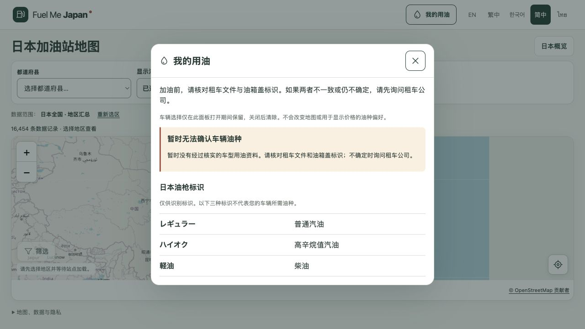

# M0.2 我的车辆用油：本地实现与验收报告

日期：2026-09-30。**本地实现和检查通过；整体 M0.2 验收仍受真实车型来源及安全文案审核阻塞。** 状态：`LOCAL_IMPLEMENTED_DATA_BLOCKED`。

本阶段位于 `codex/m0-2-my-fuel`，基线 `4fc858c`。未提交、推送或部署 M0.2；正式网站保持已验收的 M0.1 部署 `76736e97`，其发布见 `M0.1-enhancements-release.md`。

## 已实现

地图页新增紧凑的“我的用油”入口，打开五语言原生对话框。车型核验逻辑支持可选租车公司，以及精确品牌、车型、配置和车型年款。唯一且通过来源审查的精确记录才返回 VERIFIED；缺项、跨公司、年款不符、重复或冲突、来源未审、数据损坏均不猜油种。

独立车辆 manifest、registry、mappings 具有版本、字节数和 SHA-256 校验；构建会拒绝未引用车辆文件，映射须与具体来源证据的适用范围一致。五语言安全文案哈希绑定实际文字，审核状态不能由测试替代。原 M0.1 数据、登记和导入器均未改动。

车辆选择只在面板打开期间保留，关闭立即清空并恢复入口焦点。改变选择或重试立即清除旧结果，迟到响应不能恢复已关闭会话。车辆核验不读取价格偏好、站点供应或位置，不新增车辆存储、定位申请或分析数据字段。

**当前真实映射为 0，批准来源为 0。** 因此实际页面显示“暂时无法确认车辆油种”，提供租车文件／油箱盖核对提示与三种中立日文标签。选择表单和 VERIFIED 正向路径已用明确虚构、仅存在于 tests 的夹具验证，不能当作真实车型服务已可用。

## 验收与证据

| 项目 | 结果 | 依据或限制 |
| --- | --- | --- |
| lint、typecheck、静态构建 | PASS | 最终 `npm run check` 退出码 0 |
| 单元测试 | PASS | 247 项，包含匹配歧义、来源门槛、日期／URL／哈希异常和分析隐私 |
| 浏览器测试 | PASS | 172 项，0 失败、0 跳过、0 flaky；覆盖五语言、320px／桌面、焦点、重试、会话隔离及既有地图功能 |
| 数据及历史证据保护 | PASS | 84 个保护文件无变化；148 张历史截图核对，本轮改变的 11 张恢复原样 |
| 独立代码审查 | PASS | 未发现可确证的 P0／P1／P2；只读执行指纹未变，核对当时 90 个源码／测试／新数据文件快照 |
| 审查后根代理核验 | PASS | 仅简化五语言空状态文字和对应待审核哈希；完整检查再次通过，最终快照已更新 |
| 本机页面确认 | PASS | 中文真实空数据面板、日文标签正常；没有控制台错误；新增界面截图留存 |
| 真实 VERIFIED 车型资料 | BLOCKED | 候选来源的使用依据与精确车型适用范围尚未完整核验 |
| 五语言安全文案人工审核 | PENDING_REVIEW | reviewer 与 reviewedAt 保持空值，没有冒充人工审核 |
| M0.2 生产上线 | NOT_DEPLOYED | 新功能保留本地，不能把实现通过当作生产批准 |

AO 规划阶段成功；实施工作者在 600 秒超时，未计为成功交付，根代理接手核验。首轮浏览器检查的 10 个失败来自字段定位方式；第二轮剩余 1 个失败来自原生对话框浏览器焦点边界断言。最小诊断确认后修正测试，保留所有失败日志，最终全部通过。未用增加超时、跳过或自动重试掩盖问题。

独立审查后仅把“车辆映射”等措辞简化为用户能理解的“车型用油资料”，并更新待审文案哈希。审查原件与审查前快照均保留，未把后续文字改动写成审查者当时看过的事实。

## 未完成项与下一步

详见 `M0.2-source-review.md`。已查看 Toyota 日本 FAQ、按生产期区分的手册目录和租车车型等级页面；不能由等级或模糊车型名称推断实际车辆，也不能凭公开可读宣称来源使用已获准。

后续需要取得精确来源的可用依据，记录完整来源审查与证据范围，完成五语言安全文案审查，再接入首批真实映射并验收。当前不进入 M0.3。Chromium 检查不等于 Safari、真实手机或母语安全审核。本轮没有向外发送任何来源询问信息。

证据目录：`reports/evidence/m02/local-check-20260930/`。最终源码快照 `source-final-sha256.json`，完整检查 `full-check.txt`，浏览器结果 `browser-results.json`，独立审查 `independent-review.md`。

## 后续本地更新：手动油种设置

2026-09-30 用户追加要求，通过下拉菜单手动设置默认显示油种。已完成本地联动与保存，最终检查为 247 项单元测试和 179 项浏览器测试，详见 [手动油种设置报告](M0.2-manual-fuel.md)。本节记录后续变化，上方初次验收数量与原始证据保持不变；真实车型资料和安全文案审核状态未改变。

## 后续发布记录

2026-09-30 用户审核后明确授权提交、推送和上线。本报告记录的界面与手动偏好现已部署并核验，详见 [生产发布报告](M0.2-release.md)。上方保留本地验收时的原始状态；真实车型资料及独立安全文案审核限制没有改变。

## 后续 Safari 与五语言验收

2026-09-30 在本机 Safari 发现并修复原生下拉框高度问题，完整检查为 247 项单元测试、179 项 Chromium 浏览器测试通过。真实手机、母语人工审核及真实车型资料接入仍未完成，详见 [验收补充报告](M0.2-acceptance-followup.md)。本次修复尚未提交、推送或部署。

## 后续真实车型审核准备

2026-09-30 已完成有边界的官方规格表与使用条件调查，并形成 [真实车型接入审核包](M0.2-review-packet.md)。本轮仅报告及证据更新；来源使用、精确身份、人工文案审核和真机验收仍待完成。产品源码与上一轮 247 项单元／179 项浏览器检查时的快照一致，未重新运行或宣称新的完整检查。
