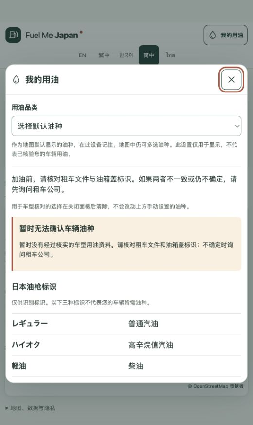

# 我的用油：手动油种设置完成报告

日期：2026-09-30。状态：`LOCAL_READY`；本轮功能与检查通过，未提交、推送或部署。

## 本轮需求与结果

用户要求在“我的用油”中通过一个下拉菜单手动设置用油品类，并同步为默认显示油种。本轮按 NORMAL 范围直接完成，未调用 AO 或子代理。

- 面板顶部增加“用油品类”下拉菜单：普通汽油 / レギュラー、高辛烷值汽油 / ハイオク、柴油 / 軽油，覆盖原有五种界面语言。
- 选择后立即将地图显示油种设为该一种，并复用既有浏览器偏好保存；关闭、重新打开和刷新仍保留。首次使用维持普通汽油默认值，兼容旧单油种存储。
- 地图仍支持任意一至三种油。多选时面板显示“选择默认油种”，避免再次选择原第一种油时原生下拉菜单不触发变化；选择任何一种都可恢复单选。
- 地图、列表和“我的用油”共用显示偏好；更改不会重建地图、重置地区或列表模式，也不会请求定位。地图中的重置操作同步到面板。
- 手动设置不依赖车型数据加载。存储不可用时仍可在当前页面使用；刷新后无法保证保存。手动偏好不会变成 VERIFIED 车型结论，也不会由车型核验结果自动覆盖。

## 实现边界

油种状态提升到 `App`，`FindFuel` 与 `MyFuel` 通过同一状态联动；没有新增存储键、依赖、后端或生产数据。车型核对仍独立、仅在面板会话中保留。新增文案与会话说明同步到五种语言，并更新车辆登记中的待审文案哈希及 manifest 校验值；真实车型记录仍为 0，安全文案状态仍为 `PENDING_REVIEW`。

## 验证

| 检查 | 结果 |
| --- | --- |
| lint / typecheck / build | PASS |
| 单元测试 | 247 PASS |
| 浏览器测试 | 179 PASS；0 失败、0 跳过、0 flaky |
| 新增回归 | 7 项：五语言、三种油、同步、保存、多选、重置、旧存储与异常边界 |
| 本机预览 | 中文下拉菜单与多选占位正常，控制台未见错误；保留用户原有两种显示油种 |
| 数据与历史证据 | 84 个保护文件未变；核对 148 张历史截图，恢复测试覆盖写入的 11 张 |
| 最终源码证据 | 91 个源码、测试、数据与构建脚本文件快照一致 |

实际执行 `npm run check`，最终退出码 0。浏览器自动化使用既有离线外部请求拦截，不代表真实地图服务可用性或真实手机验收。

先运行新增中文用例，确认旧实现因缺少下拉菜单而失败；实现后新增 7 项通过。首轮完整检查发现已有列表单元测试仍按旧属性挂载 `FindFuel`，改为从实际 `App` 入口验证同一列表可达性，随后完整检查通过。最后补充多选边界的失败证据并修复，最终完整检查再次通过。失败日志均保留，没有跳过或重试掩盖。

证据：`reports/evidence/m02/manual-fuel-20260930/`。`full-check.txt`、`browser-results.json` 与 `source-final-sha256.json` 对应最终代码；`before-multi-edge-*` 是边界修复前的检查，`first-run-*` 记录首轮类型错误。

## 发布与限制

本次仅更新本地预览 `http://127.0.0.1:4174/zh-Hans/`。正式站点未发布本功能；原有真实车型来源和五语言安全文案审核限制保持不变，不将手动偏好功能通过当作 M0.2 全部验收完成，不进入 M0.3。

## 后续发布记录

2026-09-30 用户审核后明确授权提交、推送和上线。本报告记录的界面与手动偏好现已部署并核验，详见 [生产发布报告](M0.2-release.md)。上方保留本地验收时的原始状态；真实车型资料及独立安全文案审核限制没有改变。
