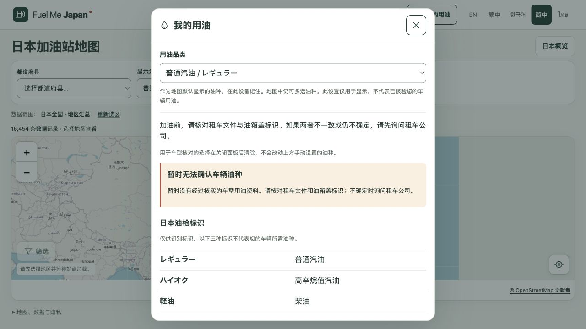

# 我的用油与手动油种设置：生产发布报告

日期：2026-09-30。状态：`PUBLISHED_VERIFIED`。

用户审核本地界面后，明确要求 commit、push、部署上线。本次已将“我的用油”入口、手动油种下拉菜单、地图联动和本地偏好保存发布到正式网站。车型记录仍为空，手动选择不形成 VERIFIED 车型结论。

- 代码提交：[`511cf9c`](https://github.com/zhyphil/fuel-me-japan/commit/511cf9c089e9d0770da045fed909cb058ef7df58)。
- GitHub：`main` 与 `codex/m0-2-my-fuel` 均推送成功，远端哈希已复核。
- 正式网址：[Fuel Me Japan](https://fuel-me-japan.com/zh-Hans/)。
- Cloudflare Pages 项目：`fuel-me-japan`，Production / `main`。
- 部署 ID：`232c2e4c-fb23-4233-85ba-5efa4d96a0fe`。
- 固定部署网址：[232c2e4c.fuel-me-japan.pages.dev](https://232c2e4c.fuel-me-japan.pages.dev)。

## 验证结果

发布前复核已通过完整检查的最终源码快照：91 个文件一致，84 个保护文件未变化。复用的实际结果是 lint、typecheck、247 项单元测试、构建和 179 项浏览器测试全部通过；没有声称本次重复运行全部检查。

正式域名下五语言页面、首页、应用脚本与样式、车辆空数据、来源和构建元数据等 19 项 HTTP 检查全部返回 200，内容与部署构建逐字节一致。85 个构建文件完成上传；仅排除生成目录中 0 字节的 `data/.import.lock`，没有修改公开源数据。

实际浏览器验证：点击“我的用油”打开面板；选择柴油后地图同步显示柴油，刷新后继续保留；重新打开面板仍选中柴油。验证后恢复原先显示的普通汽油。未请求定位，控制台错误为空。

本轮采用项目已安装的 Wrangler 4.144.0 和既有账号、项目、生产分支，未增加权限或依赖。部署方式依据 [Cloudflare Direct Upload 文档](https://developers.cloudflare.com/pages/get-started/direct-upload/)，权限核对参考 [Cloudflare Pages CI 文档](https://developers.cloudflare.com/pages/how-to/use-direct-upload-with-continuous-integration/)。

## 范围与限制

这次用户的上线授权覆盖已审核界面之前仅本地的限制。没有将登记中仍为 `PENDING_REVIEW` 的安全文案改写成已审核；没有添加真实车型数据。真实车型来源核验和五语言安全文案独立审核仍未完成，因此完整 M0.2 数据验收仍为 BLOCKED。未扩展 M0.3，未接入即时报价，保留原 noindex。

Safari、真实手机和母语安全审查不由此次 Chromium 检查替代。原 M0.2 本地报告保留当时的检查数量和状态，通过后续发布记录注明进展。

证据目录：`reports/evidence/m02/release-20260930/`，包含部署日志、生产部署记录、构建哈希、发布前复核、HTTP 比对、浏览器验证和截图。

