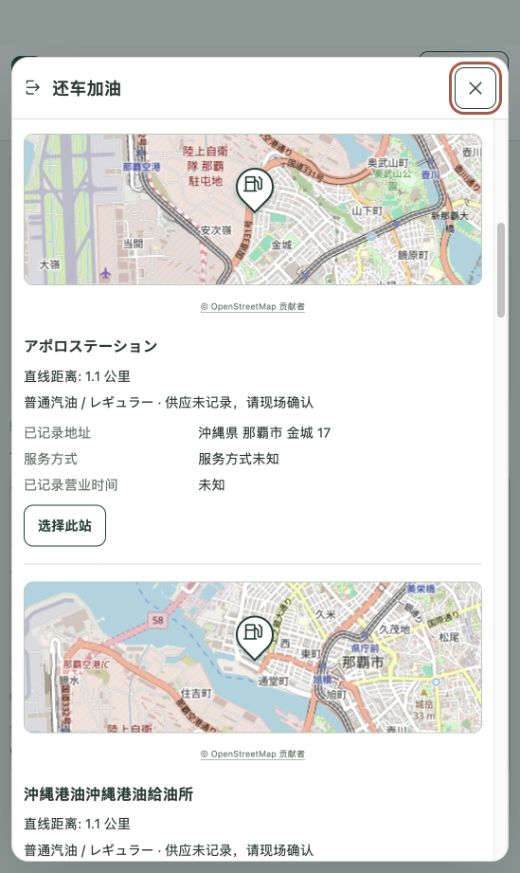

# M0.4 还车候选小地图完成报告

日期：2026-09-30。依据用户“还车加油里的每个加油候选也应有小地图”的请求完成；本次为本地预览版本。

## 交付结果

每个候选站点增加以自身记录坐标为中心的小地图，显示品牌图标或默认加油站水滴标记。桌面采用左侧地图、右侧信息；手机采用上方地图、下方信息。地图附有 OpenStreetMap 署名。

复用主页小地图及已校验的底图配置，只加载滚动区域内可见地图的瓦片；不为每个候选新建交互地图，也不重复获取配置。小地图不接管滚轮和选站操作；用户仍通过“选择此站”进入原有的加油、确认完成、返回门店流程。地图加载失败时显示本地化提示，仍可选站。五种语言均补齐可访问名称及失败文案。

本次没有修改门店清单、站点数据、定位权限、距离算法、油种偏好、外部导航流程或冻结规格。

## 验证结果

| 检查 | 实际结果 |
| --- | --- |
| 修改前回归 | 正确失败：候选预期有 3 个小地图，实际为 0 |
| `npm run check` | PASS；lint、typecheck、248 项单元测试、构建、204 项 Chromium 浏览器测试全部通过 |
| Safari WebKit 补充 | PASS；22 项手机模拟检查及 1 项桌面滚轮检查全部通过，无跳过 |
| 核心行为 | 各站坐标对应、滚动加载与卸载、切换门店、重新选站、导航目的地、五语言、底图失败后选站均通过 |
| 布局 | 320、390、768、1280px 通过，无横向溢出；地图和操作按钮尺寸已检查 |
| 本地实际页面 | 那霸门店候选已显示道路底图及水滴标记；预览停在候选列表供审核 |
| Git 与生产 | 当前分支 `codex/m0-2-my-fuel`；本次尚未提交、推送或部署 |

Safari 手机模拟器首次因不支持合成鼠标滚轮而出现 4 项测试工具错误。随后将布局和滚轮拆分：手机继续验证布局，滚轮在桌面 Safari 验证，最终全部通过。此结果不等同于实体 iPhone 触摸滑动验收。

自动化测试使用离线灰色瓦片，不作为外部底图可用性证据；实际底图另有本地浏览器截图。未运行实体手机或母语真人审核。既有测试重写的历史截图已恢复，保留历史报告原貌。

## 证据

- [最终检查与源码哈希](evidence/m04/candidate-mini-maps-20260930/verification.json)
- [完整检查日志](evidence/m04/candidate-mini-maps-20260930/full-check.txt)
- [Safari 最终检查](evidence/m04/candidate-mini-maps-20260930/webkit-check.txt)
- [初始回归失败](evidence/m04/candidate-mini-maps-20260930/initial-regression.txt)
- [Safari 初次工具限制](evidence/m04/candidate-mini-maps-20260930/webkit-unsupported-wheel.txt)
- [手机离线布局](evidence/m04/candidate-mini-maps-20260930/layout-390-offline.png)
- [桌面离线布局](evidence/m04/candidate-mini-maps-20260930/layout-1280-offline.png)

