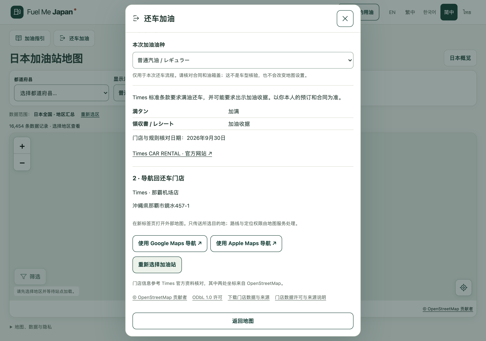

# M0.4 与本轮剩余任务发布报告

日期：2026-09-30。用户已授权完成当前剩余任务，并沿用已确认的提交、推送和上线流程。

**本轮可在当前环境完成的开发、检查、审查、GitHub 发布和 Cloudflare 部署已完成。** 正式网站：[Fuel Me Japan](https://fuel-me-japan.com/zh-Hans/)。开发范围停止于 M0.4。

## 发布内容

- “我的用油”只保留手动下拉选择、本地记忆和地图默认油种联动；完整移除车型界面、请求、空数据、判断代码和构建依赖。地图仍支持多选。
- 五语言加油指引：五个短步骤、七个日文识别标签、安全提示及资料出处。显示偏好不等于车辆油种核验。
- 还车前加油：首版 Times 那霸、新千岁、福冈机场国际线三家门店，查找附近最多十个候选，先到站加油，再由用户明确确认后显示返店导航。未知供应、服务或营业信息不补造。
- 修复 Safari 油种输入框／文字点击、触屏和键盘焦点，保留44px控件；修复图标上的双指缩放事件、列表悬停联动误取消，以及筛选提示遮挡地图点击。
- 数据更新失败时保存诊断并保留原快照，工作流不自动推送或部署候选。

## 版本与生产验收

| 项目 | 已核实结果 |
| --- | --- |
| 应用提交 | [`1ba391fcb1bce69c089f48953d3857cb2e70c31b`](https://github.com/zhyphil/fuel-me-japan/commit/1ba391fcb1bce69c089f48953d3857cb2e70c31b) |
| GitHub | 已正常推送 `main` 和 `codex/m0-2-my-fuel`，没有强制推送 |
| Cloudflare | Production / main，`b79cc5d7-e19a-408c-867e-d85903f1824b`，关联应用提交 `1ba391f` |
| 部署链接 | [b79cc5d7.fuel-me-japan.pages.dev](https://b79cc5d7.fuel-me-japan.pages.dev/) |
| 正式域名 | [fuel-me-japan.com/zh-Hans/](https://fuel-me-japan.com/zh-Hans/) |
| 资源比对 | PASS，20项：根页、五语言、入口脚本／样式、manifest／来源、指引、门店、参考价及三地站点分区；全部HTTP200并与本地构建SHA-256一致 |
| 真实线上交互 | PASS；手动柴油选择及刷新保存、指引开关与焦点、那霸实际候选、选站及确认后返店坐标；测试后恢复普通汽油 |
| 原边界 | 原00–10、noindex、分析no-op、定位隐私和核心数据哈希保持 |

部署刚结束时部分域名响应仍是旧版，第一次比对没有通过；传播后第二次完整比对全部通过，两个结果均保存。另一次 Python 默认自动请求返回403，正常 curl 请求取得200；未更改网站安全配置。没有仅凭部署命令成功就宣称上线验证通过。

部署前仅从 `dist` 排除0字节导入锁；没有改变公开来源数据。之后补充中文报告和验收记录的提交不影响已部署应用，无需为文档再次部署。证据见 [发布核验](evidence/m04/release-20260930/release-verification.json)、[HTTP比对](evidence/m04/release-20260930/production-verification.json)、[线上交互记录](evidence/m04/release-20260930/browser-verification.json)及[部署输出](evidence/m04/release-20260930/deploy.txt)。

## 检查与独立审查

| 检查 | 结果 |
| --- | --- |
| lint、typecheck、静态构建 | PASS |
| 最终全部单元测试 | PASS，248项 |
| 最终全部Chromium浏览器测试 | PASS，196项 |
| 数据导入器测试 | PASS，17项 |
| 额外浏览器矩阵 | PASS，247项，WebKit iPhone／Chromium Android模拟及桌面WebKit滚轮 |
| 最后焦点修复回归 | PASS，20项跨浏览器油种检查；最终全套也重新通过 |
| macOS Safari实际界面 | PASS，手动下拉、刷新保存、指引、复选框／文字点击和Escape焦点 |
| 独立只读审查 | 无应用或安全文案阻塞；日志被Git忽略的P2已通过另存TXT和修正链接解决 |
| 发布前源码与数据指纹 | 165项全部与最终检查快照一致 |

详见[最终检查](evidence/m04/verified-release-20260930/verification.json)、[移动验收](mobile-browser-acceptance.md)、[独立审查](independent-release-review.md)。没有把不同阶段的测试数混为同一次结果。历史截图和历史验收报告保留原结果。

## 数据维护结果及仍未完成的外部条件

- OSM：[真实远端任务36762528314](https://github.com/zhyphil/fuel-me-japan/actions/runs/36762528314)成功。51个核心文件与现有版本完全相同，没有替换数据或刷新采集日期。
- 官方参考价：[新版任务36768162258](https://github.com/zhyphil/fuel-me-japan/actions/runs/36768162258)仍在官方索引返回HTTP403后失败，自动获取状态为 **BLOCKED_HTTP_403**。失败诊断上传已成功，下载核对前后manifest／registry哈希相同，旧快照保留。当前仍是2026-09-28调查、2026-09-30发布的都道府县参考价，不能当作单站即时价格。
- gogo.gs：用户已发送咨询，会话尚未收到外部答复，未接入、未抓取、未擅自联系其他公司。
- 实体iPhone／Android、门店现场及母语真人安全审查：**NOT_RUN**。模拟、macOS Safari和AI独立复核不能冒充这些验收。

这些限制没有被标成通过；它们与已完成的应用开发／部署、失败保留机制分开记录。完整数据证据见[维护报告](data-maintenance-completion.md)。

## 交回审核

当前不再增加车型、价格数据源或新功能，不放开noindex、不启用分析。保留正式网站供用户审核和实际使用验证。

以下为使用发布数据完成流程的本地验收截图；底图在自动化中使用合成瓦片，不作为地图服务在线证明。

