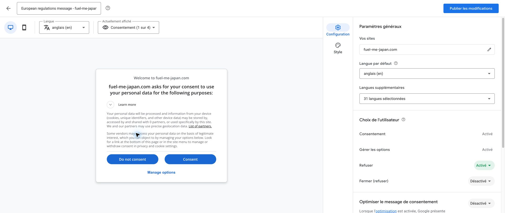
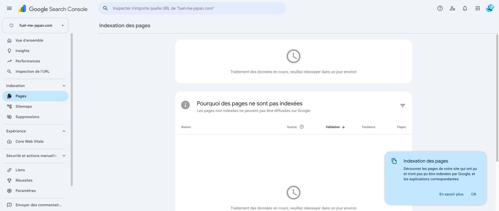

# 广告同意设置、移动端复验与收录检查 — 2026-10-01

本轮按用户同意的后续计划，处理本站 Google 同意消息、站内隐私入口、广告布局准备、移动端回归和 GSC 实际收录状态。未启用广告投放。

## Google 后台设置

用户明确批准仅修改并发布 `fuel-me-japan.com` 的消息：同意／拒绝／管理选项、关闭自动优化、设置本站隐私链接。已更新原有消息，发布后重新打开确认：

- 原消息 `European regulations message - fuel-me-japan.com` 状态为 `Publié`，未创建重复消息。
- 同意、管理选项、拒绝开启；拒绝适用于所有地区。关闭按钮仍关闭，自动优化已关闭。
- 隐私链接改为 `https://fuel-me-japan.com/en/about/#about-privacy`。
- 保留英文默认及已有 31 种附加语言。Google 提供的语言列表包含简体中文，但没有本站另外三种语言的独立选项（繁中、韩文、泰文）；不宣称 Google 消息覆盖本站全部五语言。Google 按设备语言选择，不支持的语言回退默认英文。
- 未修改其他网站、账户级消息设置、付款或广告投放设置。Google 提示消息更新可能最多需一小时生效。

## 网站改动

- About 增加可直接访问的隐私段落锚点、五语言 Google 数据说明及“隐私选择”。其他业务页页脚和首页“地图、数据与隐私”内也提供入口。
- 通过 Google `CONSENT_API_READY` 和 TCF 的适用地区信息调用官方撤回界面；就绪不代表同意。超时、失败、地区不适用均有文字提示，可重试，不阻止站内导航。
- 回调超时或组件卸载后不再意外打开窗口；撤回触发的同步 TCF 事件不会递归打开窗口。
- 广告请求仍为 `pauseAdRequests = 1`，未创建广告请求或广告单元。网站不会向 Google 广告传递设备精确坐标及油种偏好。
- CSP 仅增加 Google Funding Choices 的脚本、连接和框架来源；不添加脚本通配符、`unsafe-eval` 或内联脚本许可。正式 Google 组件的完整运行结果见发布核验补录，不能用离线夹具替代真实 Google 验收。

## 广告位置准备

本轮完成的是布局预览，**不是正式广告投放**。在加油指引完整正文和返回按钮之后预览一块横幅，保留 40px 间隔、明确广告标识；不在地图、站点详情、门店候选或安全步骤中插入广告。

预览仅在 Vite 开发模式、本机地址并显式使用 `?previewAd=guide` 时出现；生产构建无广告位、无占位空白，即使传入同一参数也不显示。320、430 和 1280px 观察均无横向溢出。真实广告单元、填充高度及拒绝情况下的广告网络行为，仍须在网站审核通过后单独验收。Google 对完整广告的 CSP 有专门要求；本轮不将同意脚本允许加载等同于完整广告链路受支持。

## 验证记录

证据目录：`reports/evidence/ads-consent-20261001/`。

| 检查 | 结果 |
|---|---|
| 新功能反向验证 | 基线缺少隐私入口、CMP 来源被 CSP 阻止，2 项预期失败 |
| lint、typecheck、静态构建 | PASS |
| 单元测试 | 363 PASS |
| 完整 Chromium 回归 | 396 PASS |
| WebKit 隐私／详情／分页／导航／动态高度专项 | 45 PASS、2 项 Chromium 专用输入模拟按设计跳过 |
| 320／430／1280px 本机广告布局预览 | 无横向溢出，操作按钮与预览保留 40px 间距 |
| iPhone／Android 实体设备复验 | 未执行，不计入通过 |

浏览器自动测试使用第三方请求拦截夹具，无真实广告点击、无广告投放。实际 Google 后台和真实脚本观察另行记录。历史报告和截图保持原样。

## GSC 与 AdSense 审核

- 本轮 GSC 仍显示 sitemap `Opération effectuée`，发现 20 页，无需再次提交。
- “页面索引”报告显示 `Traitement des données en cours, veuillez réessayer dans un jour environ`（数据处理中，约一天后重试），未提供可确认的已收录数量。不能把 20 页已发现记成 20 页已收录。
- 本轮实际 AdSense 站点页为 `En préparation`，仍在准备／审核；后台 ads.txt 状态仍为 `Introuvable`。线上文件可读与后台识别是不同结论。

## 官方依据

- [Google 同意消息设置与发布](https://support.google.com/adsense/answer/10960768?hl=en-GB)
- [Google Funding Choices 回调与撤回 API](https://developers.google.com/funding-choices/fc-api-docs?hl=en)
- [AdSense 对 CSP 的支持范围](https://support.google.com/adsense/answer/16283098?hl=en)
- [AdSense 站点审核](https://support.google.com/adsense/answer/7584263?hl=en)

## 发布核验

本节在提交、推送、部署及正式域名验证后补录；当前不以本地检查代替生产结果。
