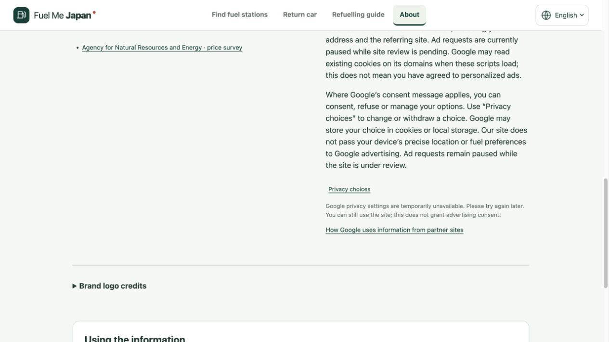

# Google 组件跟进与 iPhone 真机复测 — 2026-10-01

本轮继续检查已发布的广告同意设置、AdSense 与 GSC，并记录用户实际手机反馈。检查对象为正式域名 `fuel-me-japan.com`；线上应用仍为 `77c7e19`、生产部署 `7669b265`。本轮不修改运行代码。

## 用户确认的真机结果

用户此前提供设备为 iPhone 15 Pro Max、Chrome，本轮对以下三个操作明确回复“三项都正常”。据此记录为 **PASS（用户实测反馈）**，与自动化模拟分开：

| 操作 | 本轮结果 |
| --- | --- |
| 在站点详情正文直接滑动浏览 | PASS，用户确认 |
| 还车目录分页控件对齐和显示 | PASS，用户确认 |
| 下拉浏览时 Logo 和语言按钮持续可见 | PASS，用户确认 |

系统／浏览器版本、网络类型及测试时间未提供。不将以上反馈扩展为动态地图高度、工具栏收放、横竖屏、全部六步清单、iPhone Safari 或 Android Chrome 已通过；这些尚未收到实际结果。此前报告保留当时的待测状态。

## Google 同意窗口仍未通过真实验收

后台原消息仍为 `Publié`；同意、管理选项和拒绝开启，关闭按钮及消息自动优化关闭。本轮仅查看，未重复发布或修改其他网站。

Chrome 与独立的应用内浏览会话使用 Google 官方调试参数 `?fc=alwaysshow&fctype=gdpr`，均未显示同意窗口。AdSense 启动／实现脚本及 Funding Choices 启动／后续脚本返回 HTTP 200，记录端点返回 204。TCF 实际状态为：

```json
{"cmpLoaded":true,"cmpStatus":"loaded","gdprApplies":true,"displayStatus":"hidden"}
```

点击“隐私选择”后，入口先显示正在打开，超时后恢复可点击并显示暂不可用提示；页面可继续使用，没有将接口就绪误判为同意或窗口已打开。独立会话同样复现，当前没有证据支持仅由既有 Cookie 或某个 Chrome 扩展导致。

独立会话的最后一次加载至点击结束，捕获 34 个网络事件、17 个请求，事件缓冲无截断、无剩余分页；已知 `/pagead/ads`、`/pagead/adview`、`/pagead/interaction`、`/gampad/ads` 端点请求为 0。此结论仅限该捕获区间，不代表所有设备／时段的广告网络完整验收。代码保持广告暂停，没有新增广告单元或恢复请求。

发现一条内联样式 CSP 错误后，通过对应调用栈脚本确认来源是浏览器检查工具注入的脚本，不是网站或 Google 同意组件，因此不修改 CSP。Google 后续组件内部编号不作为公开配置含义的证据。**窗口未显示的根因仍为 UNKNOWN**；审核状态、发布传播、暂停广告等均未被证明为根因。本轮没有绕过限制、删除用户 Cookie、调用未公开的 Google 内部启动接口或更改账户级设置。



## ads.txt 与抓取文件

17:38 UTC 的 10 项正式域名 HTTP 检查全部通过：

- HTTPS 下 ads.txt、robots.txt、sitemap.xml，分别以普通检查、Googlebot 和 Mediapartners-Google 标识请求，均返回 HTTP 200。
- ads.txt 为纯文本、无 BOM，内容与源文件逐字一致，发布者和 Google 后台展示一致。
- HTTP ads.txt 正常跳转至 HTTPS 并最终返回 200。
- robots 允许这些爬虫读取 ads.txt 和 sitemap；XML 包含 20 个唯一规范页面。

模拟爬虫标识只能证明当前响应，不能证明 Google 已抓取或后台已识别。实际 AdSense 站点仍为 `En préparation`，正在审核；ads.txt 状态仍为 `Introuvable`，后台显示的更新时间为 2026-10-01 16:16 CEST。本轮没有重复提交审核或替换正确文件。Google 文档说明识别可能需要数天，低请求量站点可能更久；这不是本次问题已由缓存造成的证明。

## GSC

本轮重新查看 GSC：现有 sitemap 仍为绿色 `Opération effectuée`，发现 20 个页面，提交及最近读取日期均为 2026-10-01。页面索引报告继续提示数据处理中，未提供可确认的已收录数量。未重新提交清单；发现 20 页不等于收录 20 页。

## 本轮检查与交付边界

| 项目 | 状态 |
| --- | --- |
| 上述三个 iPhone Chrome 真实操作 | PASS，用户反馈 |
| 当前线上文件／格式／抓取规则／跳转 | 10 PASS |
| Google 组件已加载，入口超时恢复 | 已实际观察 |
| Google 同意／拒绝／管理／撤回完整窗口 | PENDING，未出现，根因 UNKNOWN |
| AdSense 审核及 ads.txt 后台识别 | PENDING |
| GSC 清单读取与发现页面 | PASS，20 页 |
| 实际搜索收录数量 | PENDING，报告处理中 |
| Android、其余手机操作、母语用户理解 | 未收到实际结果／未执行 |

证据只保存公开页面截图、脱敏状态和 HTTP 响应结果；不保存 Cookie、同意字符串、账户个人信息或不透明请求标识。没有新增数据、功能、广告请求或后台任务。运行代码未变化，沿用已发布版本的检查记录；本轮仅做文档提交和推送，不重复部署相同运行资源。

后续先复查 Google 审核／文件识别及真实同意组件是否发生变化；若仍无法显示，需要继续依据真实配置和请求证据定位，不能用离线夹具替代。同意窗口完整验收和网站审核通过前，广告请求保持暂停。

## 官方依据与证据

- [Google Funding Choices 调试参数与撤回 API](https://developers.google.com/funding-choices/fc-api-docs)
- [Google 广告暂停方式](https://support.google.com/adsense/answer/7670312?hl=en)
- [Google ads.txt 识别与常见问题](https://support.google.com/adsense/answer/12171244?hl=en)
- [Google ads.txt 文件及 HTTP 要求](https://support.google.com/adsense/answer/7679060?hl=en)
- [脱敏组件观察](evidence/ads-consent-followup-20261001/cmp-observation.json)
- [线上 HTTP 检查](evidence/ads-consent-followup-20261001/http-recheck.json)
