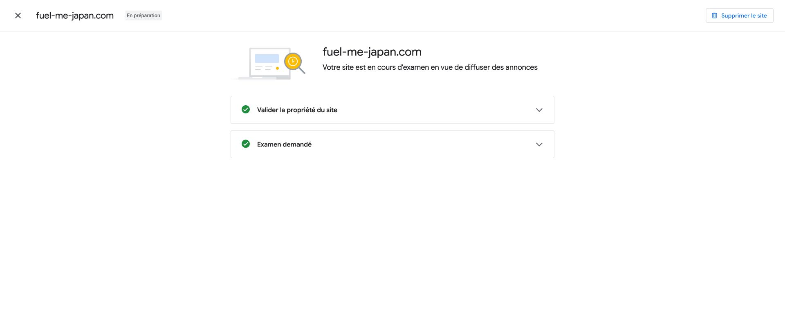

# AdSense 站点验证与送审 — 2026-10-01

## 范围与当前结果

用户要求接入 Google 广告，并提供 `ads.txt` 验证截图。已完成配置、验收、Conventional Commit、GitHub 推送和既有 Cloudflare Pages 生产部署。Google 后台已确认所有权验证通过、审核已请求，当前“审核中”，尚未获准展示广告。

- 新增根路径 `/ads.txt`，发布者 `pub-8063428584007009`，关系 `DIRECT`，认证机构 ID `f08c47fec0942fa0`；已与实际 AdSense 后台核对。
- HTML 增加 `google-adsense-account` 元数据，五语言及英文根页构建共 21 份 HTML 均包含同一账号。
- `robots.txt` 允许 `Mediapartners-Google` 与 `Google-Display-Ads-Bot` 专用审核抓取；普通爬虫仅放行 `/ads.txt`，既有页面 `noindex, nofollow` 保留。
- 本次验证方式不需要加载广告脚本，未增加广告请求、Cookies、第三方运行依赖或扩大 CSP。现有隐私文案仍描述实际行为。
- 实际广告展示、自动广告设置、广告布局及 CMP 同意消息属于后续开通环节，不能以验证文件上线宣称已获准展示广告。

## 检查

| 验收项 | 结果 | 证据 |
| --- | --- | --- |
| lint、typecheck | PASS | `evidence/adsense-20261001/check.txt` |
| 单元测试 | PASS，363 项 | 同上 |
| 静态构建与五语言预渲染 | PASS | 同上 |
| Chromium 完整浏览器测试 | PASS，338 项 | 同上及 `browser-summary.json` |
| ads.txt 格式、发布者 ID、构建复制 | PASS | `static-check.json` |
| 21 份 HTML 账号标记与 noindex | PASS | 同上 |
| 审核爬虫许可与普通页面限制 | PASS | 同上 |
| 生产发布与 HTTP 验证 | PASS，31 项 | `production-check.json`、`deployment.json` |
| AdSense 站点验证／请求审核 | PASS，Meta 验证成功，已进入审核 | `google-status.json`、`adsense-review.png` |
| Google 内容审核与广告展示 | PENDING | 外部审核尚未完成 |

这是配置修改，未新增测试设施。测试生成的旧路径截图已恢复历史版本，避免覆写以往证据。冻结规格、数据及来源登记没有变化。

## Google 官方依据

- [连接网站与审核流程](https://support.google.com/adsense/answer/7584263?hl=en)：支持 ads.txt／Meta 标签验证；站点获准前不能展示广告。
- [AdSense 专用爬虫](https://support.google.com/adsense/answer/99376?hl=en)：内容与站点验证爬虫独立于搜索爬虫。
- [广告同意管理要求](https://support.google.com/adsense/answer/13554020?hl=en)：面向欧洲经济区、英国及瑞士的广告须结合适用的认证 CMP 要求；后续启用广告前完成对应配置与隐私披露。

## 发布与后台结果

- 应用提交：`3d29ed42e3eea83b64f51d94578ca78520a46670`，已推送 `main` 与 `codex/m0-2-my-fuel`。
- 生产部署：`cf8b858b-c6f0-4271-9b8e-cbbfb6fe08a6`，Pages 环境 `Production`，分支 `main`，来源 `3d29ed4`。
- 正式验证文件：[ads.txt](https://fuel-me-japan.com/ads.txt)；部署地址：[Cloudflare 生产部署](https://cf8b858b.fuel-me-japan.pages.dev)。
- 正式域名 31 项 HTTP／内容指纹全部通过：21 份 HTML、5 个语言深层门店 URL、3 个静态验证与来源文件、2 种审核爬虫 User-Agent 的 ads.txt。
- 另核对 HTTP／www 入口共5项，均跳转到 HTTPS 主域并返回200，没有发现对应跳转故障。
- Google 首次 ads.txt 验证返回“无法验证”；同批发布的 Meta 方式成功，后台显示“En préparation／Examen demandé”及两个绿色勾选。没有将尚未确认的 ads.txt 后台授权状态当作 PASS。

## 尚未完成

Google 内容审核尚无结论。正式网页当前不含广告脚本或广告位，因此不会自动开始展示广告。后续实际投放需完成广告代码与布局、适用的 CMP 配置及五语言隐私说明，并验证同意／拒绝行为、广告请求和地图布局；这些未执行项没有计入本次 PASS。没有接受新条款、设置收款资料或产生付费购买。
