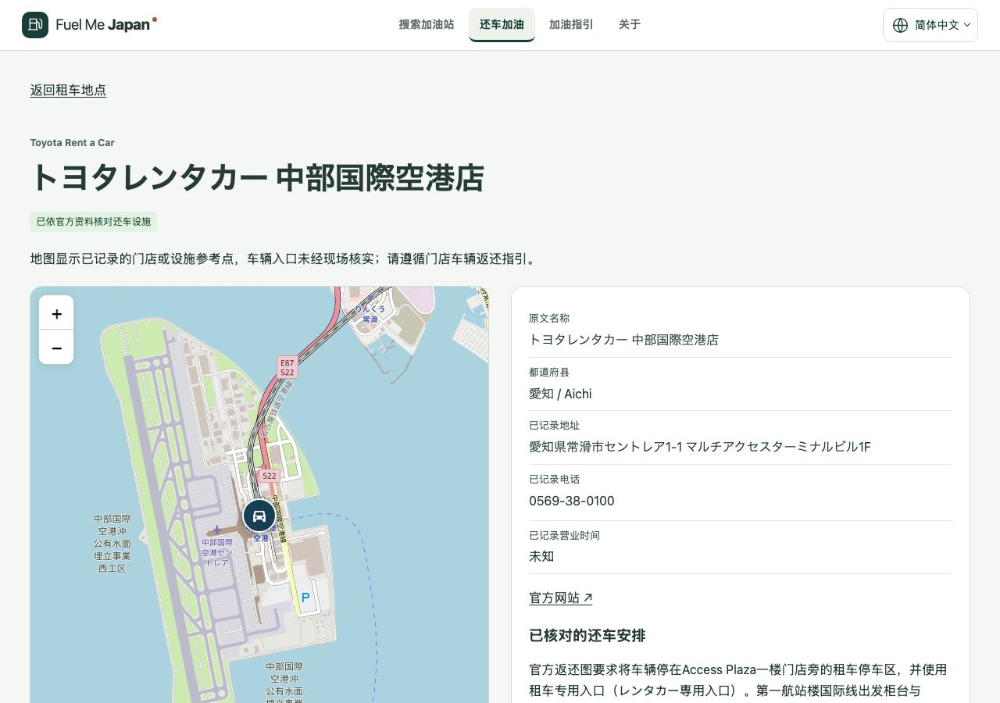

# 机场门店补核发布与持续交付约定

日期：2026-10-01。状态：**已完成Conventional Commit、推送与生产部署，正式域名验收通过。**

用户要求今后每项任务在符合预期、检查通过后自动提交、推送和部署，不再逐次等待通知。此约定已写入 `AGENTS.md` 的当前有效指引，作为本项目后续已授权任务的默认交付流程。本轮据此发布刚完成的机场补核；没有建立新的定时任务或扩大产品范围。

## 本轮发布内容

- 新增Toyota成田机场、中部国际机场及福冈INTERNATIONAL三家有限官方事实与五语言说明，合计18家已核对设施。
- 补充资料按实际内容区分官方门店详情、公司还车图／指引、机场返还指引。
- 租车数据 `rental-v1-2769bcab1437116e`，共7,383条，含7,333候选、32柜台、18家官方有限事实。原15家记录、来源及历史链接保留。
- 关西Toyota、福冈Nippon、那霸Toyota Seaside的疑点仍保留；全部车辆入口继续标明未经现场核实。

详细核对与本地验收见[补核报告](rental-airport-followup-20261001.md)。该报告保留发布前的历史状态，本报告记录后续上线结果。

## 版本与生产地址

| 项目 | 结果 |
| --- | --- |
| 应用提交 | [`3b37ab4`](https://github.com/zhyphil/fuel-me-japan/commit/3b37ab46dfda8ab9c2044a6fc9488d85a8c3e8c1) — `feat(rentals): verify three more airport branches` |
| GitHub | `main`与`codex/m0-2-my-fuel`已原子快进推送；本发布报告另作纯文档提交并推送。 |
| Cloudflare | `fuel-me-japan`，Production，分支`main` |
| 部署ID | `bee65057-82a5-4d14-8027-7378ab79c3df` |
| 部署地址 | https://bee65057.fuel-me-japan.pages.dev |
| 正式地址 | https://fuel-me-japan.com/zh-Hans/return-car/ |

沿用项目Wrangler 4.144.0及既有登录、账号、域名配置；按[Cloudflare Pages上传指引](https://developers.cloudflare.com/pages/how-to/use-direct-upload-with-continuous-integration/)和本机命令帮助确认参数。本次上传80个新资源、201个资源复用，Cloudflare记录确认应用提交与Production一致。没有升级工具或更改账号权限。

## 验证结果

| 验证 | 结果 |
| --- | --- |
| 同版本地验收 | lint、typecheck、362单元、323 Chromium、63数据、39 WebKit全部通过；沿用刚完成的最终版本证据，没有重复运行整套测试。 |
| 发布前一致性 | 382份源码／配置／数据／测试文件指纹不变；最终重新构建成功，283个构建文件中只有构建时间记录变化，其余运行资源逐字节相同。 |
| 正式域名HTTP／哈希 | **296/296通过，0失败**：281个公开资源对应最终构建SHA-256；三家新增门店的五语言深层URL共15项对应正确语言页面壳。 |
| 正式网站实际浏览器 | 三家中文详情正确显示名称、地址、电话、五语言对应摘要、参考点限制及附近加油候选。中部三种资料链接分别命名；Toyota＋FUK筛选返回正确门店并能打开详情。无页面运行错误，noindex仍在。 |
| 交付约定 | 今后已授权任务验收后自动Conventional Commit、push和部署；生产核验及中文报告也是交付的一部分。存在真实失败时如实说明，不虚报通过。 |

证据：[发布前指纹](evidence/airport-followup-release-20261001/readiness-before.json)、[最终指纹](evidence/airport-followup-release-20261001/readiness-final.json)、[构建](evidence/airport-followup-release-20261001/build.txt)、[部署日志](evidence/airport-followup-release-20261001/deploy.txt)、[Cloudflare部署记录](evidence/airport-followup-release-20261001/deployment.json)、[正式资源检查](evidence/airport-followup-release-20261001/http.json)、[实际浏览器](evidence/airport-followup-release-20261001/browser.json)。原始工具日志保留行尾空格等原始格式，源码差异检查通过。

正式页面：[成田](https://fuel-me-japan.com/zh-Hans/return-car/toyota-narita-airport/)、[中部](https://fuel-me-japan.com/zh-Hans/return-car/toyota-chubu-centrair-airport/)、[福冈](https://fuel-me-japan.com/zh-Hans/return-car/toyota-fukuoka-airport-international/)。

## 保留边界

本轮官方核对不等于现场入口或整库许可验收；实体手机、母语真人审核未执行。gogo.gs未接入，主目录既有改动、冻结规格、历史报告、定位隐私和分析no-op均保留。发布报告的后续纯文档提交不改变生产运行资源，不需要重复部署。后续按用户授权任务继续，遇到用户新的暂停或仅本地要求时优先遵守。
