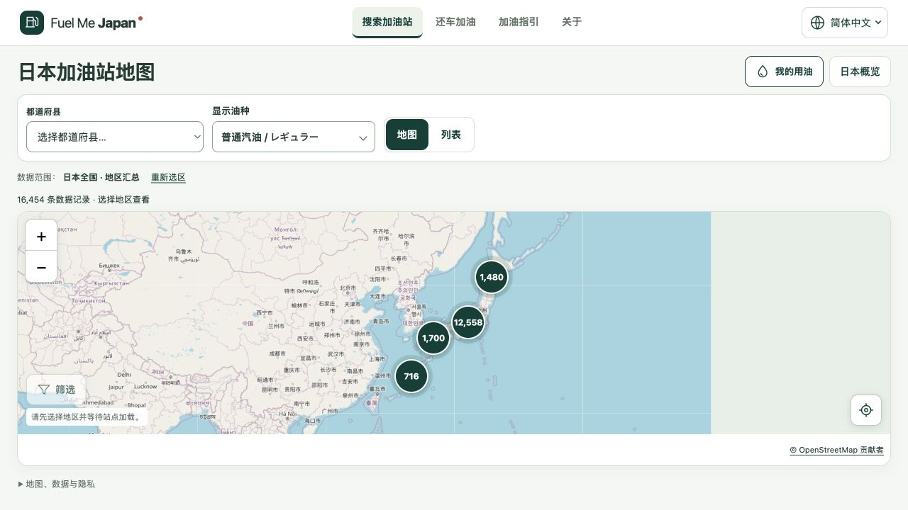

# 数据质量与当前语言显示发布报告

日期：2026-10-01。状态：**已提交、推送并部署；正式域名验收通过。**

用户要求继续后，本轮按既定流程发布已完成的数据质量维护、七机场有限事实扩充，以及“地球图标＋当前语言文字＋下拉箭头”。此前本地报告保留当时状态，本报告记录后续上线结果。

## 发布内容

- 语言入口显示 English、繁體中文、한국어、简体中文或ไทย，切换和刷新后同步；窄屏保持可读。
- 新增8家通过官方资料核对的门店有限事实：6家Nippon，以及Toyota羽田国际线与新千岁Poplar。与既有7家Times合计15家；车辆入口均仍标明未核实，各公司说明与合同提示分别处理。
- 全国租车数据版本为 `rental-v1-4292016845adde58`，共7,384条，含7,337候选、32柜台及15条官方有限事实；默认隐藏柜台后7,352条。旧来源成员、ID别名及历史快照保留。
- 数据下载限制批准的HTTPS主机与路径；重定向在下一次请求前拒绝，租车manifest发布失败时恢复原identity并保留旧数据。

实现及范围证据见[数据质量报告](rental-quality-20261001.md)、[机场逐项核对](rental-airport-review-20261001.md)和[当前语言显示报告](M0.1-language-current-label.md)。

## 发布版本

| 项目 | 已核对结果 |
| --- | --- |
| 应用提交 | [`114fc73`](https://github.com/zhyphil/fuel-me-japan/commit/114fc7338c4a0cf3e7b6830cf81648451f75ccee) |
| GitHub分支 | `main` 与 `codex/m0-2-my-fuel` 已原子推送至上述应用提交；本报告另作纯文档提交 |
| Cloudflare项目 | `fuel-me-japan`，Production，分支 `main` |
| 部署ID | `d10c74c3-03c2-4b3f-a3be-af9b297fa26c` |
| 部署地址 | https://d10c74c3.fuel-me-japan.pages.dev |
| 正式地址 | https://fuel-me-japan.com/zh-Hans/ |

沿用项目锁定的Wrangler 4.144.0和既有账号／Pages配置。命令及分支参数按[Cloudflare Pages官方命令文档](https://developers.cloudflare.com/workers/wrangler/commands/pages/)核对。实际上传81个新资源，147个资源已存在；部署记录确认Production与应用提交匹配。证据：[部署原始日志](evidence/data-quality-language-release-20261001/deploy.txt)、[部署记录](evidence/data-quality-language-release-20261001/deployment.json)。后续报告提交不改变部署应用版本。

## 检查与生产验收

本次发布没有重复执行刚完成的整套本地检查。发布前重新构建，并核对327份源码／配置／数据文件未变；230份构建文件中仅 `build-provenance.json` 的构建时间记录变化，其他运行资源与已验收构建逐字节一致。沿用相同源码的测试结果，生产验证则在本次部署后实际执行。

| 检查 | 结果及证据 |
| --- | --- |
| 同版完整本地检查 | lint、typecheck、362单元测试、构建／预渲染及315 Chromium通过；[原始日志](evidence/language-current-label/check.log) |
| 当前语言WebKit检查 | 8项通过；[日志](evidence/language-current-label/webkit.log) |
| 数据维护检查 | 63项通过；[日志](evidence/data-quality-20261001/data-tests-final.log) |
| 门店／布局WebKit检查 | 30项通过；[日志](evidence/data-quality-20261001/webkit-final.log) |
| 本次最终构建 | 通过；[构建日志](evidence/data-quality-language-release-20261001/build.txt)、[构建前指纹](evidence/data-quality-language-release-20261001/readiness-before.json)、[构建后指纹](evidence/data-quality-language-release-20261001/readiness-final.json) |
| 正式域名资源完整性 | **243/243通过，0失败**；228个公开资源与最终构建SHA-256一致，另15个五语言Times／Nippon／Toyota详情深层URL与相应语言页面壳一致；[明细](evidence/data-quality-language-release-20261001/http.json) |
| 实际线上浏览器 | 中文首页显示当前语言；菜单切换English后地址与文字同步；新增Nippon羽田门店的地址、电话、官网、核对日期、入口限制及附近加油站正确加载；[记录](evidence/data-quality-language-release-20261001/browser.json) |

首页现场截图：

新增门店截图见[线上门店详情](evidence/data-quality-language-release-20261001/production-rental.jpg)。本次未更改定位权限、noindex、分析no-op、品牌素材或冻结规格；主项目目录的用户既有改动未覆盖。

## 仍保留的限制

- 官方都道府县参考价索引及工作簿仍返回HTTP403；141条既有参考价与原日期保留。未绕过限制，也未将其冒充单站即时价格。
- gogo.gs尚未签约、未接入，私有报价PDF未公开。6条未采纳的机场候选仍因身份／地址／坐标冲突保持原状态。
- 官方资料核对不等于车辆入口现场核实或整库授权。实体手机、母语真人与现场入口检查未执行。
- 构建仍提示已有主包超过500kB，本次未扩大为性能改造。

本轮发布及验收完成，停止继续新增功能，等待用户下一项具体要求。
