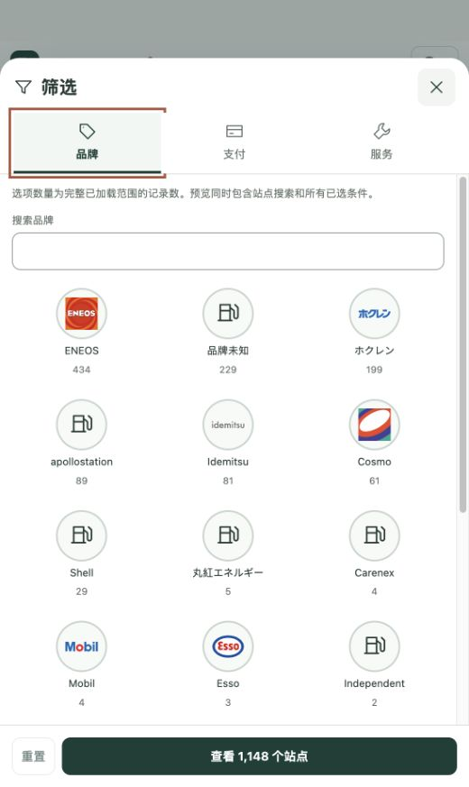
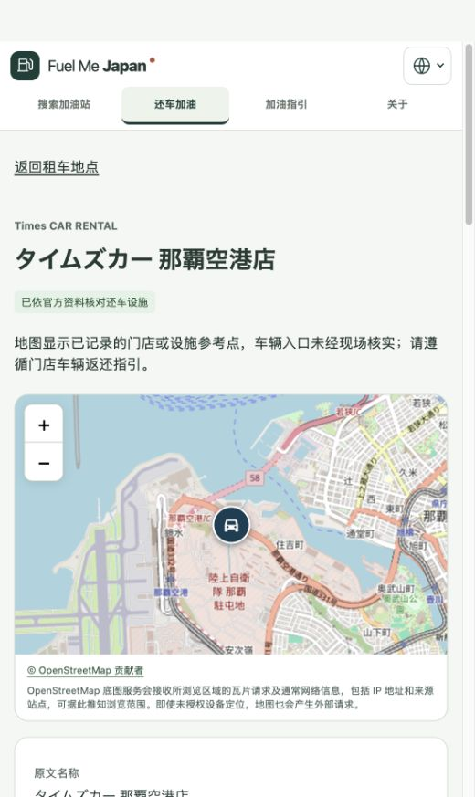

# 此前更改统一发布报告

日期：2026-10-01（Europe/Paris）
结论：**已提交、推送并正式部署；线上验收通过。**

## 发布内容

- 全国租车门店候选库、独立还车目录与门店详情；按地区、公司和名称检索。7个重点机场各有1家Times设施的官方资料核对记录。
- 总地图、逐店/逐站小地图、列表与地图联动；限高列表、10/25/50/100条分页和直接输入页码；候选卡片按钮移至标题右侧。
- 全站业务导航、独立加油指引、About及联系邮箱、地球图标语言下拉菜单；“我的用油”保留在找站页面。
- 新增12份本地品牌素材，合计14个品牌身份，附来源记录与About署名。未确认身份或复用依据的品牌保留默认图标。

## GitHub 与正式部署

- 仓库：[zhyphil/fuel-me-japan](https://github.com/zhyphil/fuel-me-japan)。已推送`main`与`codex/m0-2-my-fuel`。
- 功能提交：[`2be2e01`](https://github.com/zhyphil/fuel-me-japan/commit/2be2e014bf0c11f8dd9f377f1df6a053da771855)。
- 最终应用及托管配置提交：[`5ccb5f0`](https://github.com/zhyphil/fuel-me-japan/commit/5ccb5f09a1adc12bffc7a1a8edc3803596857826)。
- 正式网址：[Fuel Me Japan](https://fuel-me-japan.com/zh-Hans/)。
- Cloudflare Pages部署：`a5c2b6ab-e075-4e20-851e-f23e81c3afa8`，`Production`，`main`；[部署地址](https://a5c2b6ab.fuel-me-japan.pages.dev)。
- `www.fuel-me-japan.com`与`fuel-me-japan.pages.dev`继续301跳转到正式域名。HTTPS验证正常，邮件转发配置未变更。
- 后续证据提交仅更新报告与任务记录，不改变上面的实际部署应用提交。

## 验收结果

| 检查 | 结果与证据 |
| --- | --- |
| lint、typecheck | 通过；[完整检查记录](evidence/brand-logos/check.txt) |
| 单元测试 | 352项通过；沿用相同应用源文件的最近完整检查 |
| Chromium浏览器测试 | 295项通过，0失败/跳过/重试通过 |
| WebKit定向检查 | 8项通过；覆盖品牌图片及About页面，非实体手机测试 |
| 数据测试 | 本轮重跑41项通过；[日志](evidence/release-20261001/data-check.txt) |
| 最终构建 | 通过；全部数据来源、分区及哈希检查通过；[日志](evidence/release-20261001/build-final.txt) |
| Pages本地重写 | 5种语言详情深层地址均返回对应语言目录壳；[结果](evidence/release-20261001/pages-local-routes-after.json) |
| 正式域名完整性 | **179/179通过**：174个静态资源及5个门店详情地址；均HTTP 200，且SHA-256与最终构建一致；[明细](evidence/release-20261001/http-final.json) |
| 正式浏览器操作 | About及联系方式、语言切换保留路径、独立指引、默认25条分页、输入295直达末页、门店详情刷新及候选加载、品牌Logo显示均通过；[记录](evidence/release-20261001/verification.json) |

最后一次全量检查后，只有两个静态托管配置文件发生修正。最终构建的全部JS/CSS、HTML、数据和图标与全量检查时逐文件相同；仅`_headers`、`_redirects`及构建时间记录不同，见[最终指纹](evidence/release-20261001/readiness-final.json)。因此保留有效的全量测试证据，额外执行构建、Pages重写及真实线上验证。

数据测试第一次使用系统Python因缺少shapely/openpyxl未通过；切换到本机已有Anaconda Python后41项全部通过，未安装依赖或改写代码。构建仍提示入口压缩后约519 kB；该提示不阻断构建，本轮未扩大到性能重构。

## 上线验收发现并修复的问题

1. 初次部署的详情重写目标包含`index.html`，Pages判定归一化后形成循环，忽略了全部5条规则。改为对应语言的规范目录URL后，本地解析为5条有效规则，正式深层链接均返回正确语言壳。依据：[Pages重写说明](https://developers.cloudflare.com/pages/configuration/redirects/)、[HTML路径归一化说明](https://developers.cloudflare.com/pages/configuration/serving-pages/)。
2. About的邮箱被Cloudflare自动混淆，导致发布内容与预渲染不一致。加入`Cache-Control: public, max-age=0, must-revalidate, no-transform`保留源页面内容；现有缓存重新验证行为与安全响应头保留。5种语言About页面现均与本地构建完全一致，公开邮箱可直接使用。依据：[Cloudflare邮箱混淆说明](https://developers.cloudflare.com/waf/tools/scrape-shield/email-address-obfuscation/)。

初次[失败检查](evidence/release-20261001/http-initial.json)与[本地复现日志](evidence/release-20261001/pages-local-reproduction.txt)保留为历史证据；最终通过结果以上表为准。

## 保留的边界

全国库共7385条，默认列表7353条（排除32条柜台记录）；候选并非全面核实的营业或还车地点。7家Times设施仍不等于7机场所有租车公司，全部车辆入口未现场核实。暂无站点即时油价，gogo.gs接入继续等待明确的授权和可用数据；noindex和分析no-op保持原状态。品牌文件来源声明不等于商标授权或合作背书。

本轮未进行实体手机和母语真人验收；GitHub未配置应用检查工作流，因此不将本地检查描述为远端应用CI通过。主项目目录已有的独立改动未覆盖；本次发布来自fuel-find工作区。

## 正式站点截图

