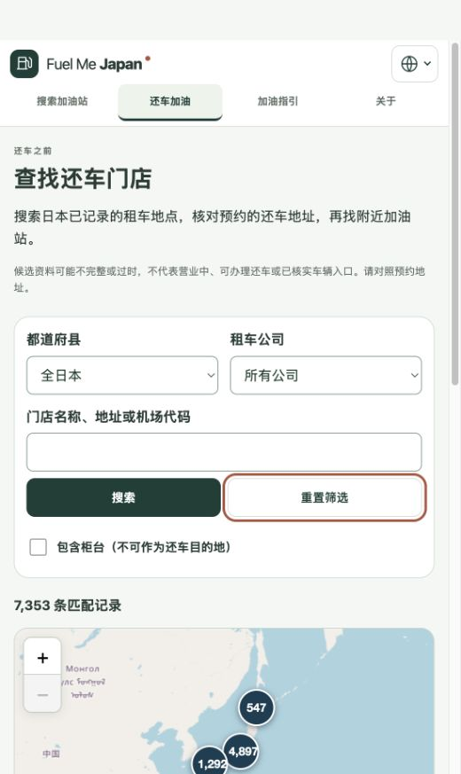

# 还车门店加载修复发布报告

日期：2026-10-01。结论：**已提交、推送并部署上线，验收通过；按用户要求停止后续工作。**

本轮发布还车门店目录的稳定首屏、加载转圈及占位说明、空结果和失败重试状态，包含五语言文案。用户已明确要求 commit、push、部署并在完成后休息；本轮没有新增业务功能。

## 版本与部署

- 应用提交：[`02fff4b`](https://github.com/zhyphil/fuel-me-japan/commit/02fff4bd93ba82afd07ddedeb62d0f1237134b65)，已推送 `main` 和 `codex/m0-2-my-fuel`。
- 正式页面：[还车加油](https://fuel-me-japan.com/zh-Hans/return-car/)。
- Cloudflare Pages：`fuel-me-japan`，`Production`，`main`。
- 部署 ID：`6504d838-274c-42bb-9230-370abd2ff730`；[部署地址](https://6504d838.fuel-me-japan.pages.dev)。
- 本报告及发布证据作为后续文档提交推送，不改变上述应用构建。

沿用项目已有 Wrangler 配置、本地固定版本和已授权账号；发布前核对 `pages (write)` 权限及目标项目，未修改凭据或扩展权限。所用命令依据 [Wrangler Pages 官方说明](https://developers.cloudflare.com/workers/wrangler/commands/pages/)及本机命令帮助。

## 验收

| 项目 | 结果 |
| --- | --- |
| lint、typecheck、单元与浏览器检查 | 复用上一轮同一源码的完整通过结果：352 单元、307 Chromium、24 WebKit；详见[修复报告](rental-loading-state.md) |
| 最终构建 | 本轮重新构建通过；源码指纹未变，所有运行资源与已验收构建一致，仅构建时间记录更新 |
| 生产环境及提交 | Cloudflare 列表确认 `Production` / `main` / `02fff4b` |
| 正式域名完整性 | **180/180 通过**；175 个静态资源及5种语言的详情深层地址均 HTTP 200，SHA-256 与最终本地构建一致 |
| 正式浏览器 | 首次导航显示禁用表单、加载文字和占位说明；随后显示 7,353 条记录；搜索无匹配名称显示 0 条和对应说明，转圈消失；重置恢复 7,353 条 |
| 正式页面布局 | 有结果与空结果之间，标题及搜索表单的位置和尺寸完全一致；慢代码、慢数据阶段的五语言布局覆盖见上一轮自动化证据 |

构建仍有既有主包体积提示，构建通过；本次未新跑全套测试，因为部署前指纹确认源码及运行资源与刚刚验收的版本相同。WebKit 是模拟浏览器测试，并非实体手机验收。数据、地图服务、站点即时油价与既有来源边界均未在本轮变更。

证据：[构建与指纹](evidence/rental-loading-release/readiness.json)、[构建输出](evidence/rental-loading-release/build.txt)、[部署输出](evidence/rental-loading-release/deploy.txt)、[生产记录](evidence/rental-loading-release/deployment.json)、[线上资源检查](evidence/rental-loading-release/http.json)、[浏览器检查](evidence/rental-loading-release/browser.json)。

## 完成状态

本轮发布完成。保留当前工作区，主目录的独立历史改动未覆盖；没有启动下一项开发或新的后台任务。按用户指示先暂停，等待新的要求。

